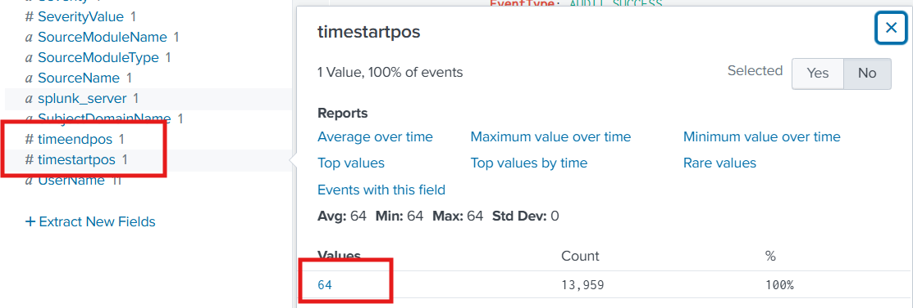
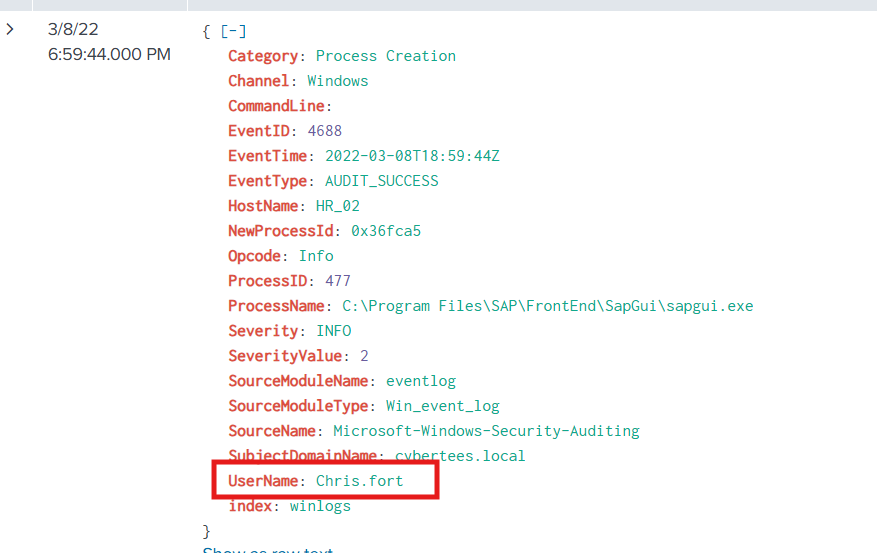
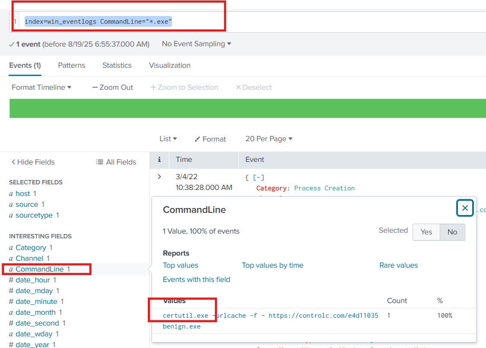
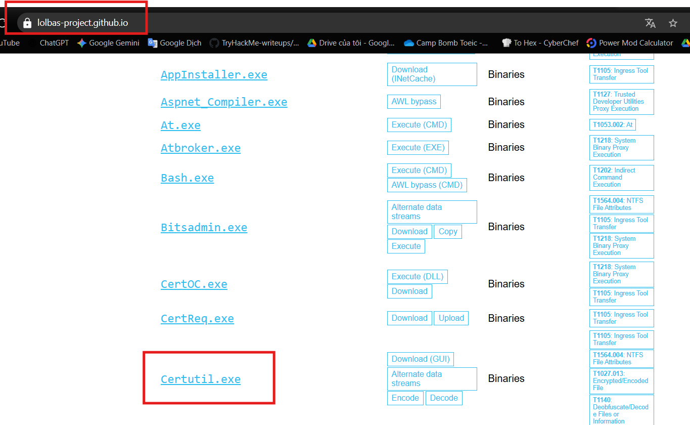
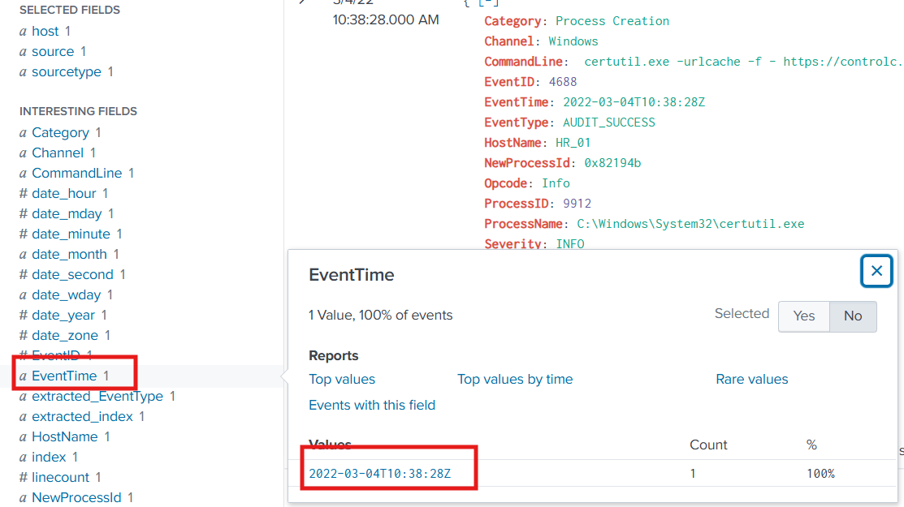

One of the client’s IDS indicated a potentially suspicious process execution indicating one of the hosts from the HR department was compromised. Some tools related to network information gathering / scheduled tasks were executed which confirmed the suspicion. Due to limited resources, we could only pull the process execution logs with Event ID: 4688 and ingested them into Splunk with the index win_eventlogs for further investigation.

#### About the Network Information

The network is divided into three logical segments. It will help in the investigation.

*IT Department*

James
Moin
Katrina
HR department

Haroon
Chris
Diana
Marketing department

Bell
Amelia
Deepak

---
## Answer the questions below 
**Câu 1:** How many logs are ingested from the month of March, 2022?
>13959

**Câu 2:** Imposter Alert: There seems to be an imposter account observed in the logs, what is the name of that user?


>Amel1a

**Câu 3:** Which user from the HR department was observed to be running scheduled tasks?




>Chris.fort

**Câu 4:** Which user from the HR department executed a system process (LOLBIN) to download a payload from a file-sharing host.
***Question Hint:*** Explore lolbas-project.github.io/ to find binaries used to download payloads
Thử truy cập lolbas-project.github.io/ , đây là web có các lolbins có thể được sử dụng để tải xuống payload.
Thử truy vấn sau để tìm các lệnh thực thi file .exe:

```
index=win_eventlogs CommandLine="*.exe"
```
để tìm các lệnh thực thi file .exe.




chính nó, xem user thì là: 
>haroon

**Câu 5:** To bypass the security controls, which system process (lolbin) was used to download a payload from the internet?
Đáp án có từ câu trên
>certutil.exe

**Câu 6:** What was the date that this binary was executed by the infected host? format (YYYY-MM-DD)
Vẫn là nó 



**Câu 7:** Which third-party site was accessed to download the malicious payload?
> controlc.com

**Câu 8:** What is the name of the file that was saved on the host machine from the C2 server during the post-exploitation phase?
> benign.exe

**Câu 9:** The suspicious file downloaded from the C2 server contained malicious content with the pattern THM{..........}; what is that pattern?
 vào web https://controlc.com/e4d11035 là thấy
> THM{KJ&*H^B0}
**Câu 10:** What is the URL that the infected host connected to?

>https://controlc.com/e4d11035