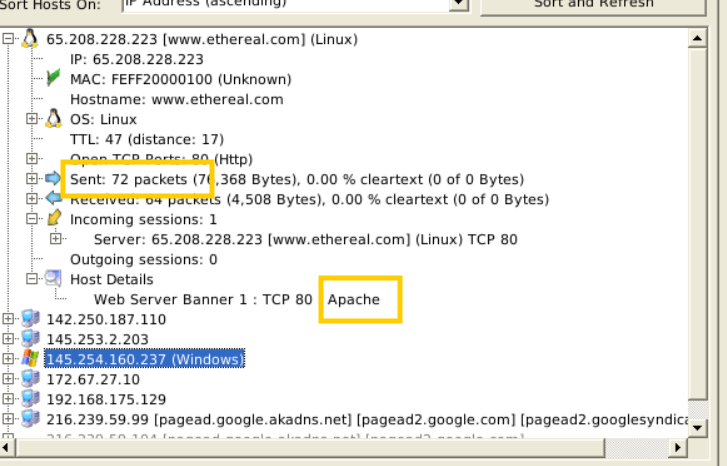

### Answer the questions below
Use mx-3.pcap

**Cau 1:** What is the total number of frames?

460

**Cau 2:**  How many IP addresses use the same MAC address with host 145.253.2.203?

2

**Cau 3:**  How many packets were sent from host 65.208.228.223?

72

**Cau 4:**  What is the name of the webserver banner under host 65.208.228.223?

Apache

Use mx-4.pcap

**Cau 5:** What is the extracted username?

#B\Administrator

**Cau 6:** What is the extracted password?

$NETNTLMv2$#B$136B077D942D9A63$FBFF3C253926907AAAAD670A9037F2A5$01010000000000000094D71AE38CD60170A8D571127AE49E00000000020004003300420001001E003000310035003600360053002D00570049004E00310036002D004900520004001E0074006800720065006500620065006500730063006F002E0063006F006D0003003E003000310035003600360073002D00770069006E00310036002D00690072002E0074006800720065006500620065006500730063006F002E0063006F006D0005001E0074006800720065006500620065006500730063006F002E0063006F006D00070008000094D71AE38CD601060004000200000008003000300000000000000000000000003000009050B30CECBEBD73F501D6A2B88286851A6E84DDFAE1211D512A6A5A72594D340A001000000000000000000000000000000000000900220063006900660073002F003100370032002E00310036002E00360036002E0033003600000000000000000000000000

