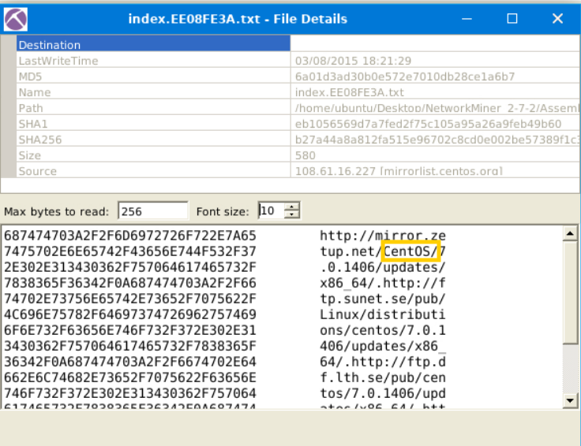
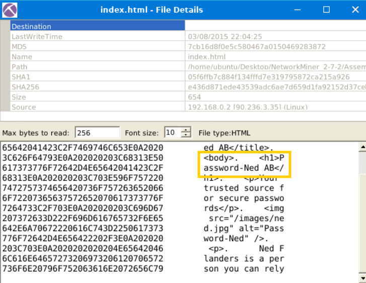
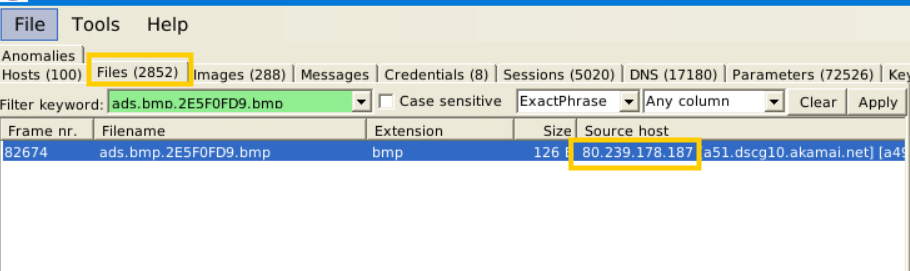
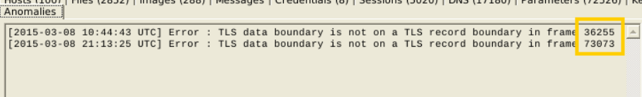
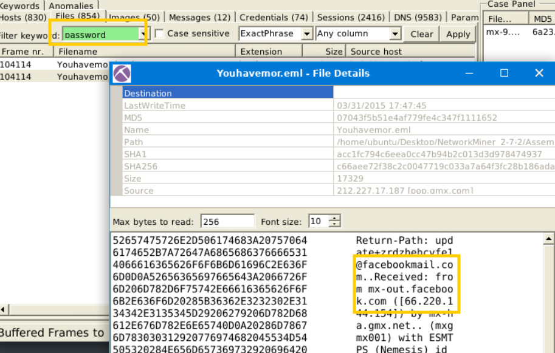
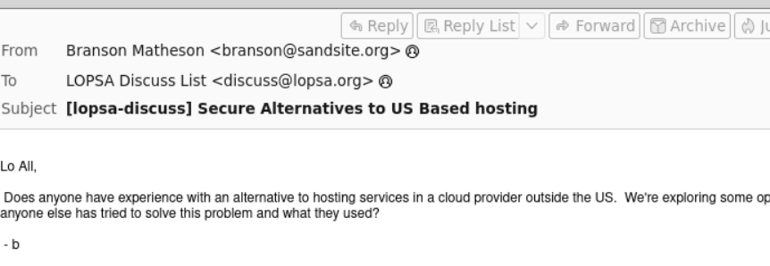

### Use mx-7 pcap

**Cau 1** What is the name of the Linux distro mentioned in the file associated with frame 63075? 

> CentOS

**Cau 2** What is the header of the page associated with frame > 75942?

Password-Ned AB

**Cau 3** What is the source address of the image "ads.bmp.2E5F0FD9.bmp"?

80.239.178.187

**Cau 4** What is the frame number of the possible TLS anomaly?

36255

Use mx-9 file

Look at the messages. Which platform sent a password reset email?

Facebook

What is the email address of Branson Matheson?

branson@sandsite.org
