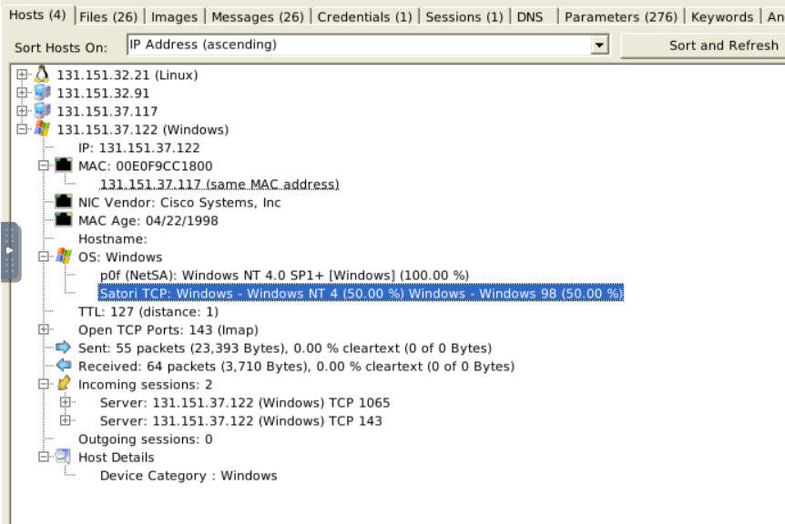

### Use case1.pcap

What is the OS name of the host 131.151.37.122?

Windows - Windows NT 4 

**Cau 2:** Investigate the hosts 131.151.37.122 and 131.151.32.91.
How many data bytes were received from host 131.151.32.91 to host 131.151.37.122 through port 1065?

192

**Cau 3:** Investigate the hosts 131.151.37.122 and 131.151.32.21.
How many data bytes were received from host 131.151.37.122 to host 131.151.32.21 through port 143?

20769

**Cau 4:** What is the sequence number of frame 9?

2AD77400

**Cau 5:** What is the number of the detected "content types"?

2

**Cau 6:** Use case2.pcap and investigate the files.
What is the USB product's brand name?

ASIX

**Cau 7:** What is the name of the phone model?

Lumia 535

**Cau 8:** What is the source IP of the fish image?

50.22.95.9

**Cau 9:** What is the password of the "homer.pwned.se@gmx.com"?

spring2015

**Cau 10:** What is the DNS Query of frame 62001?

