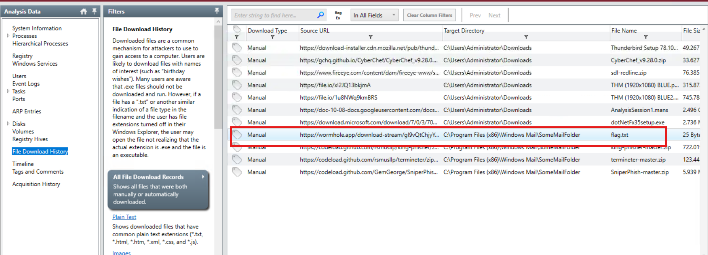
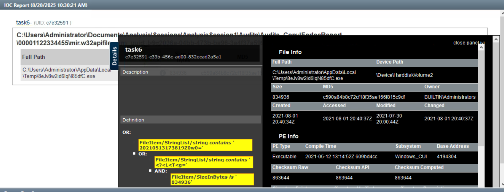

### Task 4
#### Answer the questions below

**1. Provide the Operating System detected for the workstation.**  

*Windows Server 2019 Standard 17763*

---

**2. What is the suspicious scheduled task that got created on the computer?**  

*MSOfficeUpdateFa.ke*

---

**3. Find the message that the intruder left for you in the task.** 

*THM-p3R5IStENCe-m3Chani$m*

---

**4. There is a new System Event ID created by an intruder with the source name "THM-Redline-User" and the Type "ERROR". Find the Event ID #.**  

*546*

---

**5. Provide the message for the Event ID.**  

*Someone cracked my password. Now I need to rename my puppy-++-*

---

**6. It looks like the intruder downloaded a file containing the flag for Question 8. Provide the full URL of the website.**  

*`https://wormhole.app/download-stream/gI9vQtChjyYAmZ8Ody0AuA`*

---

**7. Provide the full path to where the file was downloaded to including the filename.**  

*`C:\Program Files (x86)\Windows Mail\SomeMailFolder\flag.txt`*

---

**8. Provide the message the intruder left for you in the file.** 
 
*`THM{600D-C@7cH-My-FR1EnD}`*

### Task 5
#### Answer the questions below

**1. What is the actual filename of the Keylogger?**  
*psylog.exe*

---

**2. What filename is the file masquerading as?**  
*THM1768.exe*

---

**3. Who is the owner of the file?**  
*WIN-2DET5DP0NPT\charles*

---

**4. What is the file size in bytes?**  
*35400*

---

**5. Provide the full path of where the .ioc file was placed after the Redline analysis, include the .ioc filename as well**  
*`C:\Users\charles\Desktop\Keylogger-IOCSearch\IOCs\keylogger.ioc`*

### Task 6
**Scenario:** You are assigned to do a threat hunting task at Osinski Inc. They believe there has been an intrusion, and the malicious actor was using the tool to perform the lateral movement attack, possibly a "pass-the-hash" attack.

**Task:** Can you find the file planted on the victim's computer using IOC Editor and Redline IOC Search Collector?

So far, you only know the following artifacts for the file: 

**File Strings:** 

`20210513173819Z0w0=`
`<?<L<T<g=`
**File Size (Bytes):**
834936

**Note:** Use the existing Redline Session found in: `C:\Users\Administrator\Documents\Analysis\Sessions\AnalysisSession1`

**Làm mất thời gian vc :(**
B1: Mở app IOCs, tạo file ioc
B2: Nhập các thông tin sau vào file ioc:
- File Strings: 
  - `20210513173819Z0w0=`
  - `<?<L<T<g=`
- File Size (Bytes):
  - 834936

Lưu lại
B3: Mở file `AnalysisSession1` tạo báo cáo mới từ file ioc vừa tạo, đợi lâu vc, được kết quả như sau:

#### Answer the questions below

**1. Provide the path of the file that matched all the artifacts along with the filename.**  
*`C:\Users\Administrator\AppData\Local\Temp\8eJv8w2id6IqN85dfC.exe`*

---

**2. Provide the path where the file is located without including the filename.**  
*`C:\Users\Administrator\AppData\Local\Temp\`*

---

**3. Who is the owner of the file?**  
*BUILTIN\Administrators*

---

**4. Provide the subsystem for the file.**  
*Windows_CUI*

---

**5. Provide the Device Path where the file is located.**  
*\Device\HarddiskVolume2*

---

**6. Provide the hash (SHA-256) for the file.**  
*57492d33b7c0755bb411b22d2dfdfdf088cbbfcd010e30dd8d425d5fe66adff4*

mọe câu này hint là dùng Get-FileHash mà không được

lên web VirusTotal tìm theo MD5

---

**7. The attacker managed to masquerade the real filename. Can you find it having the hash in your arsenal?**  
*PsExec.exe*

### Task 7
#### Answer the questions below

**1. Can you identify the product name of the machine?**  
*Windows 7 Home Basic*

---

**2. Can you find the name of the note left on the Desktop for the "Charles"?**  
*_R_E_A_D___T_H_I_S___AJYG1O_.txt*
tìm theo notepad.exe thì ra

---

**3. Find the Windows Defender service; what is the name of its service DLL?**  
*MpSvc.dll*

---

**4. The user manually downloaded a zip file from the web. Can you find the filename?**  
*eb5489216d4361f9e3650e6a6332f7ee21b0bc9f3f3a4018c69733949be1d481.zip*

---

**5. Provide the filename of the malicious executable that got dropped on the user's Desktop.**  
*Endermanch@Cerber5.exe*

tìm Desktop thì ra 

---

**6. Provide the MD5 hash for the dropped malicious executable.**  
*fe1bc60a95b2c2d77cd5d232296a7fa4*

tra tên trên VirusTotal không ra kết quả, lần mò thì thấy trong timeline có MD5

---

**7. What is the name of the ransomware?**  
*Cerber*