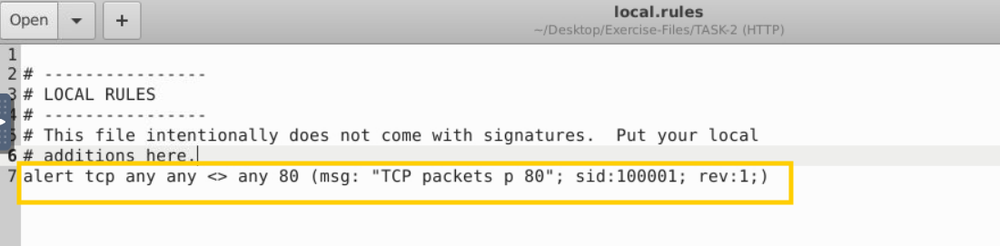
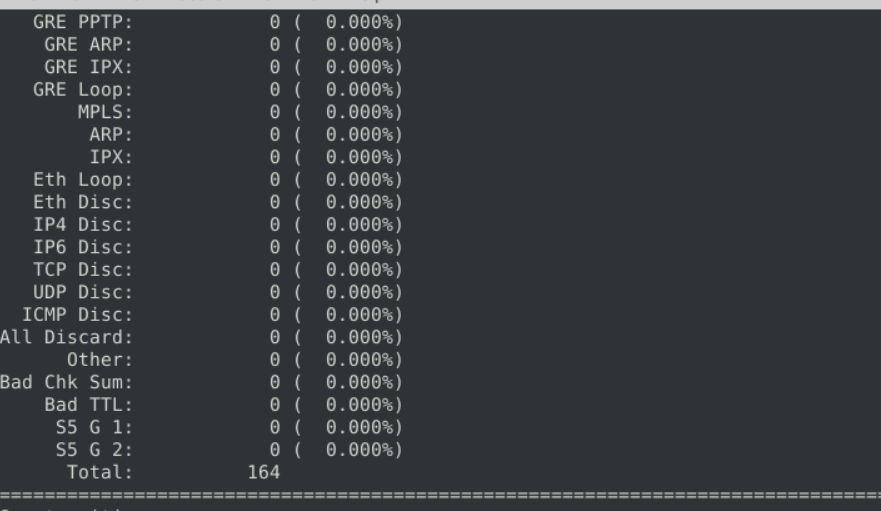

### Let's create IDS Rules for HTTP traffic!

> **Câu 1:**Navigate to the task folder and use the given pcap file.Write a rule to detect all TCP packets from or to port 80.
What is the number of detected packets you got?

B1: Thêm rule

B2: quét và tạo log : sudo snort -c local.rules -A full -l . -r file

B3: Đọc file log snort -r snort.log.121213131

>**Đáp án** 164

What is the destination address of packet 63?
`sudo snort -c local.rules -A full -l . -r file -n 63`
>**Đáp án** 216.239.59.99
 What is the ACK number of packet 64?
`sudo snort -c local.rules -A full -l . -r file -n 64`
>**Đáp án** 0x2E6B5384
What is the SEQ number of packet 62?
>**Đáp án** 0x36C21E28
What is the TTL of packet 65?
>**Đáp án** 128
What is the source IP of packet 65?
>**Đáp án** 145.254.160.237
What is the source port of packet 65?
>**Đáp án** 3372
