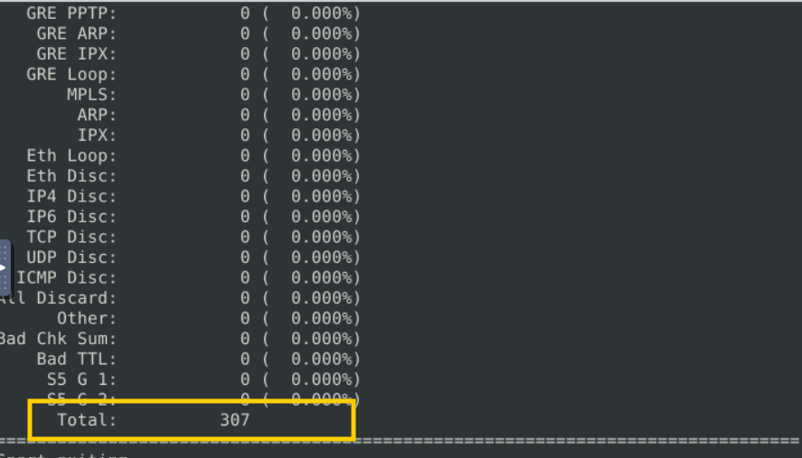
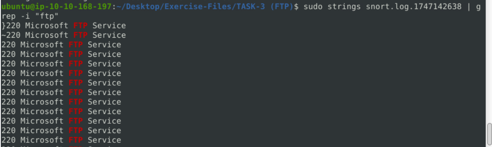
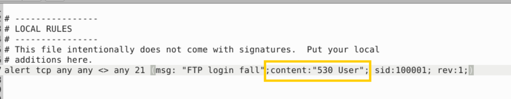
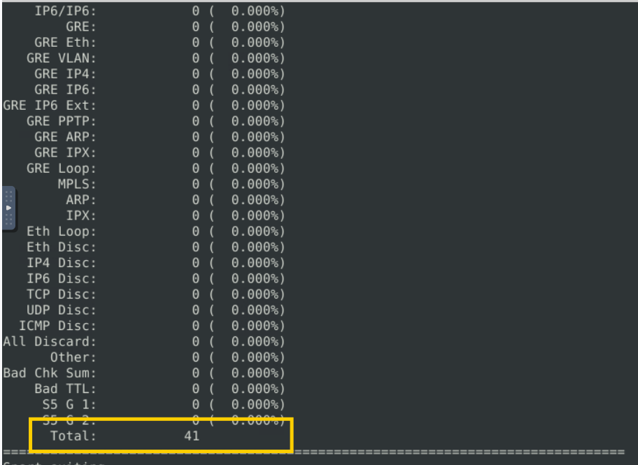
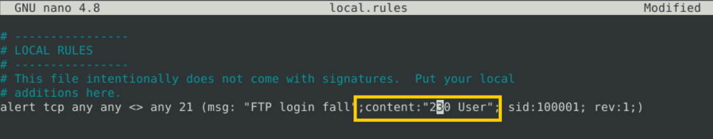
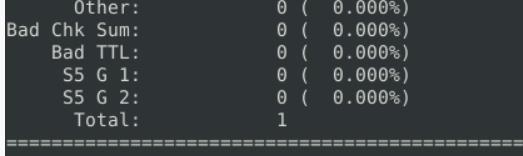
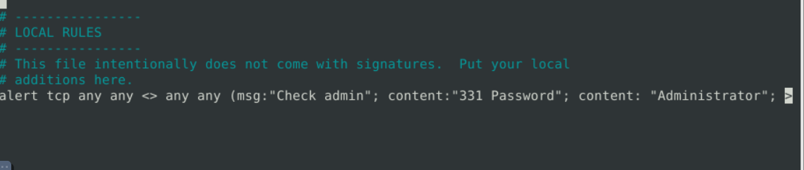

### Let's create IDS Rules for FTP traffic!
**Answer the questions below**

Navigate to the task folder.

Use the given pcap file.

>**Câu 1:** Write a single rule to detect "all TCP port 21"  traffic in the given pcap.
>What is the number of detected packets?

B1: vào file, thêm rule: `alert tcp any any <> any 21 (msg:"TCP port 21"; sid:100001; rev:1;)`
B2: chạy lệnh `sudo snort -c local.rules -A full -l . -r ftp-png-gif.pcap` 
B3: sudo snort -r 

>**Câu 2:** Investigate the log file.
>What is the FTP service name?

**Question Hint**
Strings or the -a option with grep might help.
**Dùng lệnh**
`sudo strings snort.log.1747142638 | grep -i "530"`

-->Microsoft FTP Service

>Clear the previous log and alarm files.
>
>Deactivate/comment on the old rules.
>
>Write a rule to detect failed FTP login attempts in the given pcap.
>
>**What is the number of detected packets?**

**Question Hint**

Each failed FTP login attempt prompts a default message with the pattern; **"530 User"**. Try to filter the given pattern in the inbound FTP traffic.
>B1: Thêm lệnh 

>Write a rule to detect FTP login attempts with a valid username but no password entered yet.
>**What is the number of detected packets?**

**230 đăng nhập thành công; 530 không thành công**
đăng nhập FTP  bằng tên người dùng hợp lệ  nhưng chưa nhập mật khẩu. **"331 Password"**
Clear the previous log and alarm files.

Deactivate/comment on the old rule.

Write a rule to detect FTP login attempts with the "Administrator" username but no password entered yet.

What is the number of detected packets?

>**đáp án: 7**