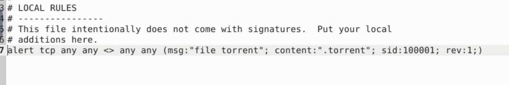
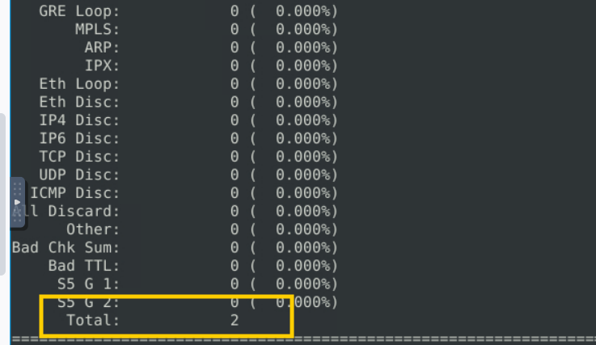
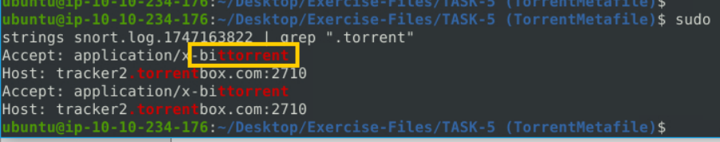

**Câu 1 :** Use the given pcap file.

Write a rule to detect the torrent metafile in the given pcap.

 What is the number of detected packets?
 

2 :cloud:

**Câu 2 :** Investigate the log/alarm files.

What is the name of the torrent application?

bittorrent :*

**Câu 3 :** Investigate the log/alarm files. 

What is the MIME (Multipurpose Internet Mail Extensions) type of the torrent metafile?

application/x-bittorrent :)

**Câu 4 :** Investigate the log/alarm files.

What is the hostname of the torrent metafile?

tracker2.torrentbox.com 	:rocket:

:cat:
