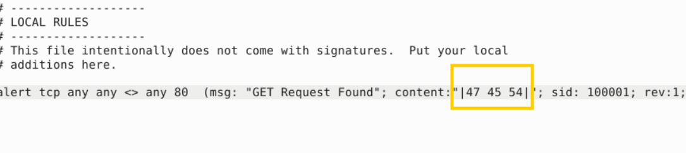

In this section, you need to fix the syntax errors in the given rule files. 

You can test each ruleset with the following command structure;

sudo snort -c local-X.rules -r mx-1.pcap -A console

Fix the syntax error in local-1.rules file and make it work smoothly.

**What is the number of the detected packets?**

16

Fix the syntax error in local-2.rules file and make it work smoothly.

What is the number of the detected packets?

68
Correct Answer
Hint
Fix the syntax error in local-3.rules file and make it work smoothly.

What is the number of the detected packets?

87
Correct Answer
Hint
Fix the syntax error in local-4.rules file and make it work smoothly.

What is the number of the detected packets?

90
Correct Answer
Hint
Fix the syntax error in local-5.rules file and make it work smoothly.

What is the number of the detected packets?

155
Correct Answer
Hint
Fix the logical error in local-6.rules file and make it work smoothly to create alerts.

**What is the number of the detected packets?**
> Lệnh sai get không viết hoa, đổi GET sang hex

2

Fix the logical error in local-7.rules file and make it work smoothly to create alerts.

What is the name of the required option:

msg
Correct Answer
Hint
