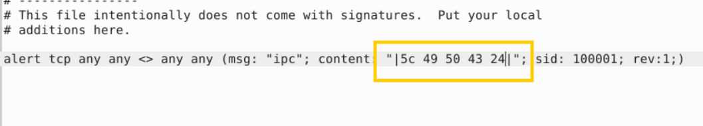
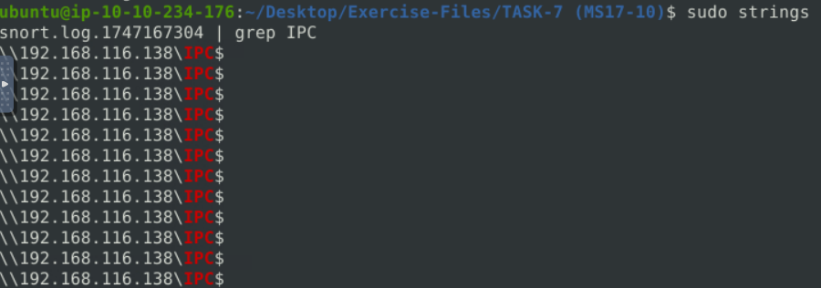
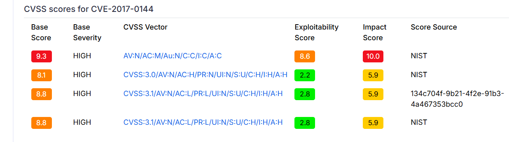

Use the given rule file (local.rules) to investigate the ms1710 exploitation.

What is the number of detected packets?
>25154

Use local-1.rules empty file to write a new rule to detect payloads containing the "\IPC$" keyword.

What is the number of detected packets?
**Đổi sang hex**

Investigate the log/alarm files.

What is the requested path?

What is the CVSS v2 score of the MS17-010 vulnerability?
**Tìm trên gg**

