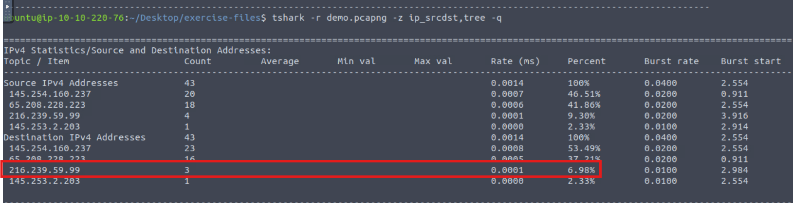
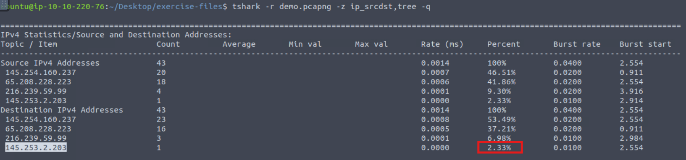
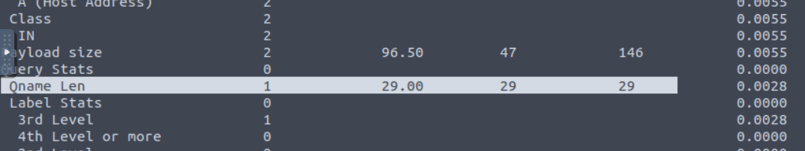

### Answer the questions below
Use the "demo.pcapng" to answer the questions.

---

**Question 1:**  
Which IP address has 7 appearances?  
Enter your answer in defanged format.  

**Answer:** 216[.]239[.]59[.]99  

---

**Question 2:**  
What is the "destination address percentage" of the previous IP address?  

**Answer:** 6.98%  

---

**Question 3:**  
Which IP address constitutes "2.33% of the destination addresses"?  
Enter your answer in defanged format.  

**Answer:** 145[.]253[.]2[.]203  

---

**Question 4:**  
What is the average "Qname Len" value?  

**Answer:** 29.00  