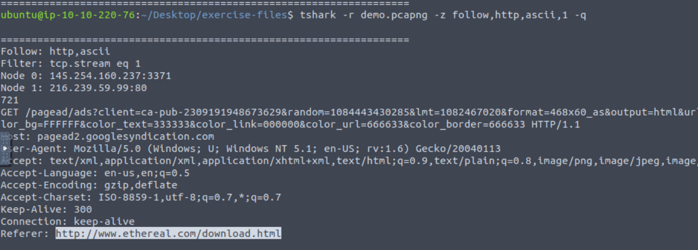

### Answer the questions below
Use the "demo.pcapng" to answer the questions.

---

**Question 1:**  
Follow the "UDP stream 0".  
What is the "Node 0" value?  
Enter your answer in defanged format.  

**Answer:** 145[.]254[.]160[.]237:3009  

---

**Question 2:**  
Follow the "HTTP stream 1".  
What is the "Referer" value?  
Enter your answer in defanged format.  

**Answer:** hxxp[: //]www[.]ethereal[.]com/download[.]html  

---

**Question 3:**  
Use the "credentials.pcap" to answer the question.  
What is the total number of detected credentials?  

**Answer:** 75  