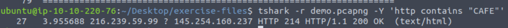
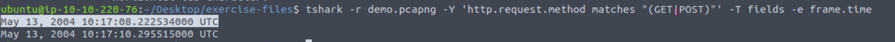

### Answer the questions below
Use the "demo.pcapng" to answer the questions.

---

**Question 1:**  
What is the HTTP packet number that contains the keyword "CAFE"?  

**Answer:** 27  

---

**Question 2:**  
Filter the packets with "GET" and "POST" requests and extract the packet frame time.  
What is the first time value found?  

**Answer:** May 13, 2004 10:17:08.222534000 UTC  