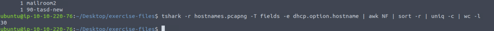
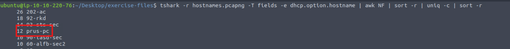
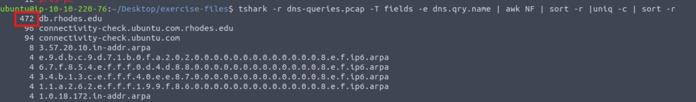
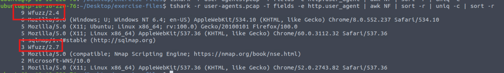
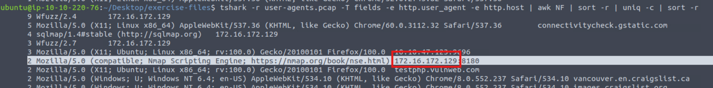

### Answer the questions below
Use the "hostnames.pcapng" to answer the questions.

---

**Question 1:**  
What is the total number of unique hostnames?  

**Answer:** 30  

---

**Question 2:**  
What is the total appearance count of the "prus-pc" hostname?  

**Answer:** 12  

---

Use the "dns-queries.pcap" to answer the question.

---

**Question 3:**  
What is the total number of queries of the most common DNS query?  

**Answer:** 472  

---

Use the "user-agents.pcap" to answer questions.

---

**Question 4:**  
What is the total number of the detected "Wfuzz user agents"?  

**Answer:** 12  

---

**Question 5:**  
What is the "HTTP hostname" of the nmap scans?  
Enter your answer in defanged format.  

**Answer:** 172[.]16[.]172[.]129  