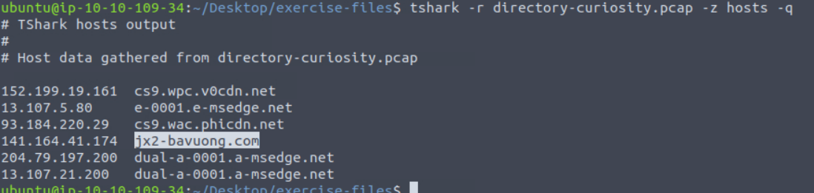
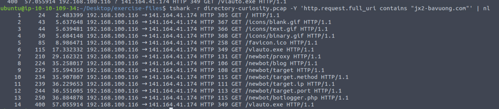
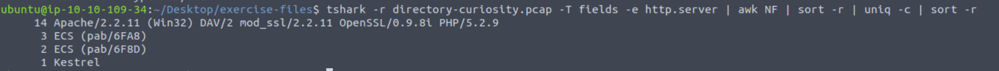
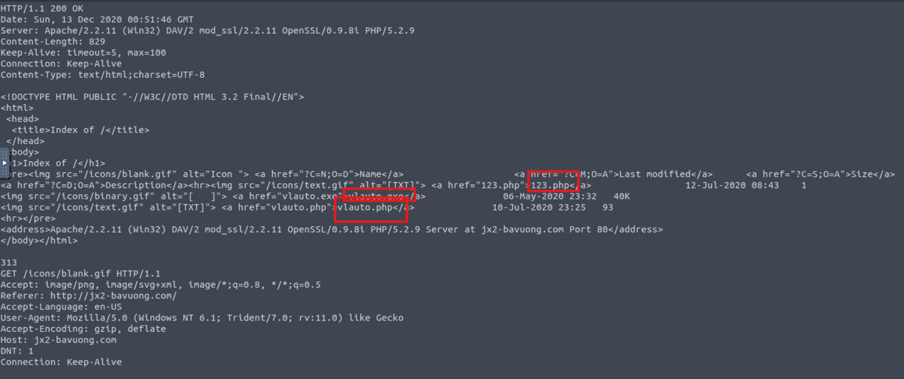
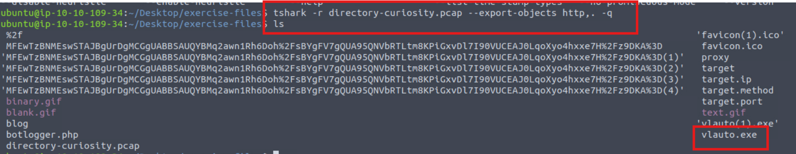
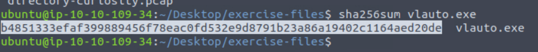

### Answer the questions below
Investigate the DNS queries.  
Investigate the domains by using VirusTotal.  
According to VirusTotal, there is a domain marked as malicious/suspicious.

---

**Question 1:**  
What is the name of the malicious/suspicious domain?  
Enter your answer in a defanged format.  

**Answer:** jx2-bavuong[.]com  

---

**Question 2:**  
What is the total number of HTTP requests sent to the malicious domain?  

**Answer:** 14  

---

**Question 3:**  
What is the IP address associated with the malicious domain?  
Enter your answer in a defanged format.  

**Answer:** 141[.]164[.]41[.]174  

---

**Question 4:**  
What is the server info of the suspicious domain?  

**Answer:** Apache/2.2.11 (Win32) DAV/2 mod_ssl/2.2.11 OpenSSL/0.9.8i PHP/5.2.9  

---

**Question 5:**  
Follow the "first TCP stream" in "ASCII".  
Investigate the output carefully.  
What is the number of listed files?  

**Answer:** 3  

---

**Question 6:**  
What is the filename of the first file?  
Enter your answer in a defanged format.  

**Answer:** 123[.]php  

---

**Question 7:**  
Export all HTTP traffic objects.  
What is the name of the downloaded executable file?  
Enter your answer in a defanged format.  

**Answer:** vlauto[.]exe  

---

**Question 8:**  
What is the SHA256 value of the malicious file?  

**Answer:** b4851333efaf399889456f78eac0fd532e9d8791b23a86a19402c1164aed20de  

---

**Question 9:**  
Search the SHA256 value of the file on VirusTotal.  
What is the "PEiD packer" value?  

**Answer:** .NET executable  

---

**Question 10:**  
Search the SHA256 value of the file on VirusTotal.  
What does the "Lastline Sandbox" flag this as?  

**Answer:** MALWARE TROJAN  