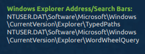
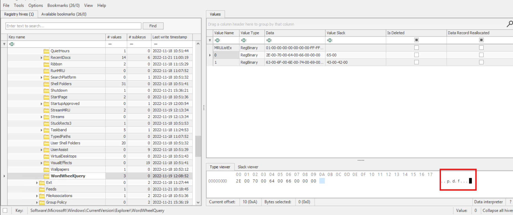
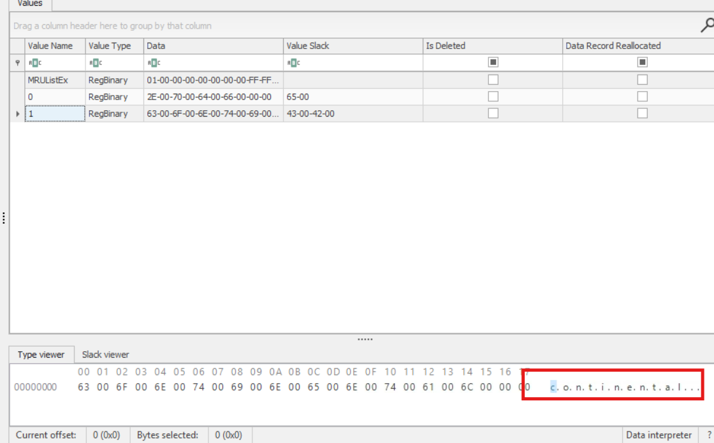
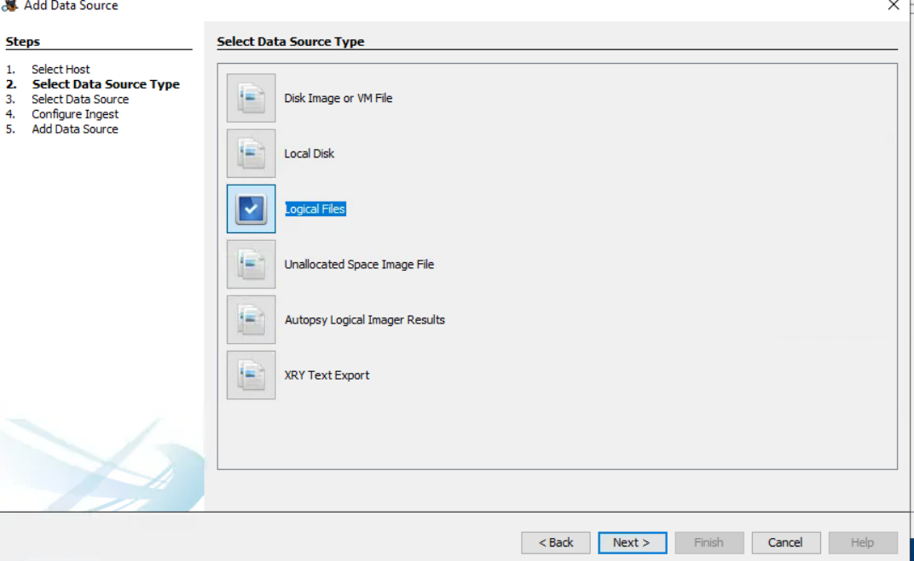
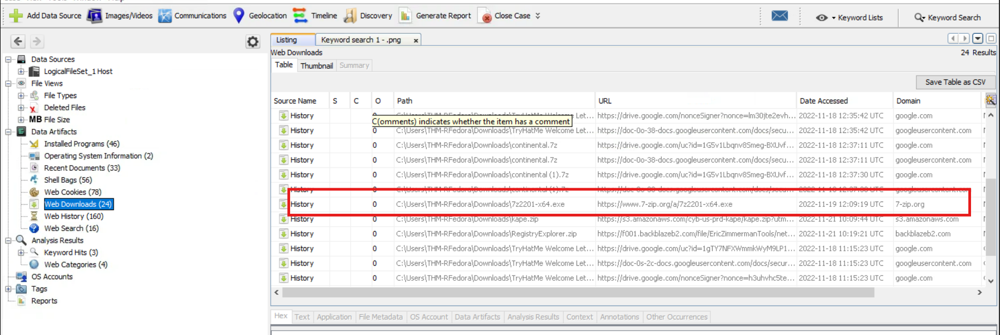

### Task 3: Snooping around

#### Answer the questions below
Mở Registry Explorer chọn từ file kape trên desktop. 
Từ task 2 thấy hướng dẫn, điều hướng đến đó

**Câu 1:** What file type was searched for using the search bar in Windows Explorer?

> Đáp án: .pdf

**Câu 2:** What top-secret keyword was searched for using the search bar in Windows Explorer?

> Đáp án: continental

### Task 4: Can't simply open it

#### Answer the questions below
Mở Autopsy, tạo case mới, 

rồi chọn file từ file KAPE trên desktop

**1. What is the name of the downloaded file to the Downloads folder?**  

*7z2201-x64.exe*

---

**2. When was the file from the previous question downloaded? (YYYY-MM-DD HH:MM:SS UTC)**  
*2022-11-19 12:09:19 UTC*

---

**3. Thanks to the previously downloaded file, a PNG file was opened. When was this file opened? (YYYY-MM-DD HH:MM:SS)**  
*2022-11-19 12:10:21*

### Task 5: Sending it outside

#### Answer the questions below

**1. A text file was created in the Desktop folder. How many times was this file opened?**  
*2*

---

**2. When was the text file from the previous question last modified? (MM/DD/YYYY HH:MM)**  
*11/19/2022 12:12*

---

**3. The contents of the file were exfiltrated to pastebin.com. What is the generated URL of the exfiltrated data?**  
*`https://pastebin.com/1FQASAav`*

---

**4. What is the string that was copied to the pastebin URL?**

**ne7AIRhi3PdESy9RnOrN*

