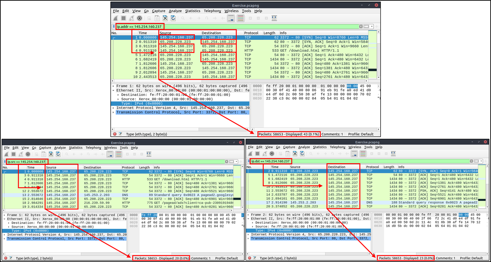
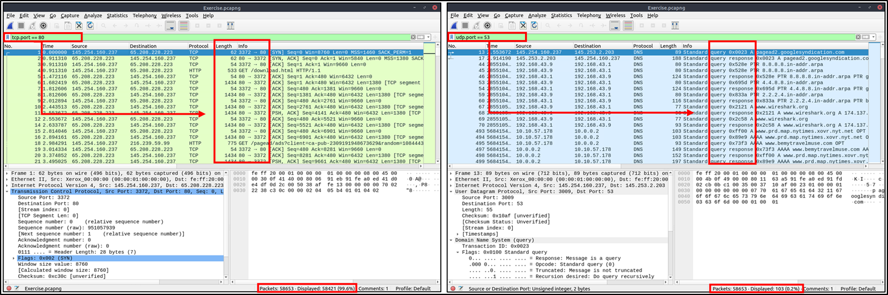
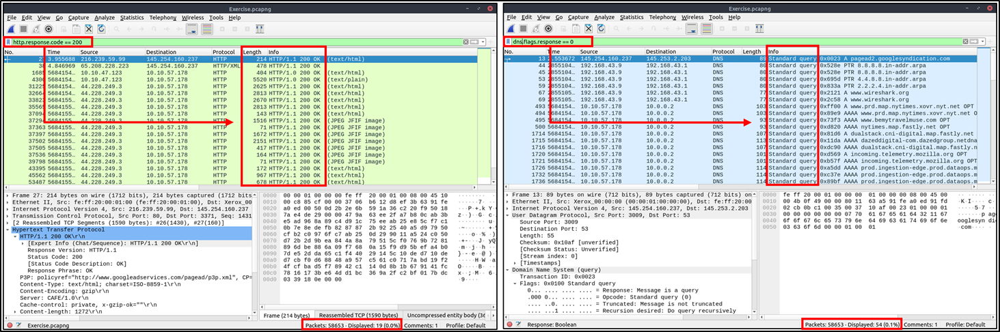
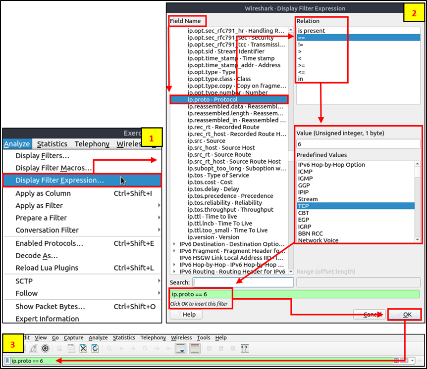
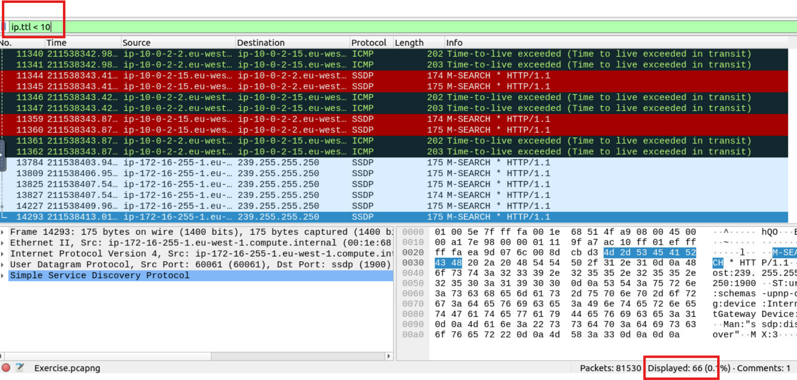
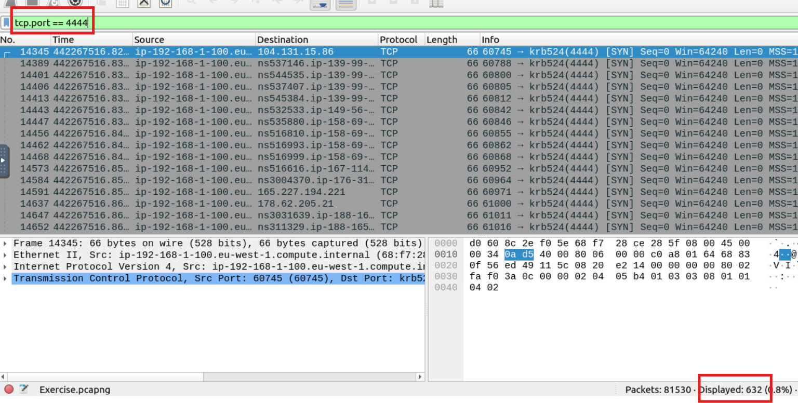
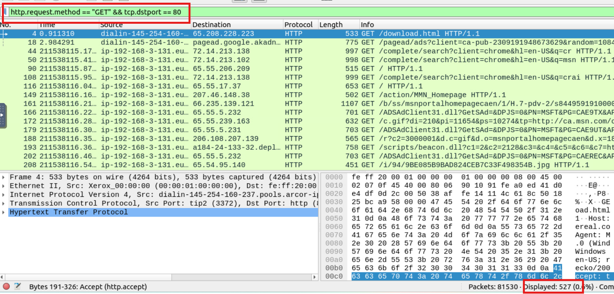
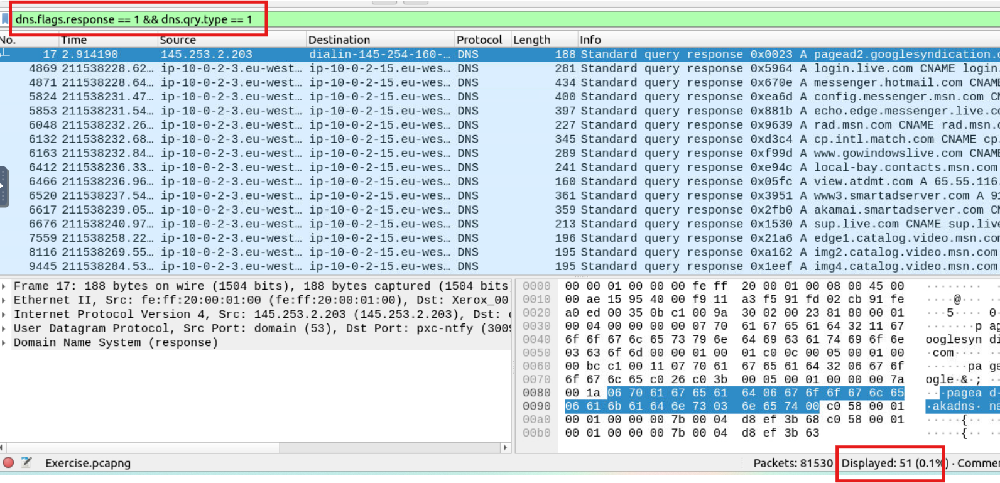

# Bộ lọc trong Wireshark

## Bộ lọc IP

Bộ lọc IP giúp các nhà phân tích lọc lưu lượng theo thông tin cấp IP từ các gói tin (Lớp mạng của mô hình OSI). Đây là một trong những bộ lọc được sử dụng phổ biến nhất trong Wireshark. Các bộ lọc này lọc thông tin cấp mạng như địa chỉ IP, phiên bản, TTL, loại dịch vụ, cờ và checksum.

| Lọc | Sự miêu tả |
|------|-------------|
| `ip` | Hiển thị tất cả các gói IP |
| `ip.addr == 10.10.10.111` | Hiển thị tất cả các gói tin có địa chỉ IP 10.10.10.111 |
| `ip.addr == 10.10.10.0/24` | Hiển thị tất cả các gói tin chứa địa chỉ IP từ mạng con 10.10.10.0/24 |
| `ip.src == 10.10.10.111` | Hiển thị tất cả các gói tin có nguồn gốc từ 10.10.10.111 |
| `ip.dst == 10.10.10.111` | Hiển thị tất cả các gói tin được gửi đến 10.10.10.111 |

> **Lưu ý**: `ip.addr` lọc lưu lượng mà không xem xét hướng gói tin. `ip.src`/`ip.dst` lọc gói tin tùy thuộc vào hướng.

## Bộ lọc TCP và UDP

Bộ lọc TCP giúp phân tích lưu lượng dựa trên thông tin tầng vận chuyển (Transport Layer).

| Lọc | Sự biểu lộ |
|------|-------------|
| `tcp.port == 80` | Hiển thị tất cả các gói tin TCP có cổng 80 |
| `udp.port == 53` | Hiển thị tất cả các gói UDP có cổng 53 |
| `tcp.srcport == 1234` | Hiển thị tất cả các gói TCP có nguồn gốc từ cổng 1234 |
| `udp.srcport == 1234` | Hiển thị tất cả các gói UDP có nguồn gốc từ cổng 1234 |
| `tcp.dstport == 80` | Hiển thị tất cả các gói TCP được gửi đến cổng 80 |
| `udp.dstport == 5353` | Hiển thị tất cả các gói UDP được gửi đến cổng 5353 |

## Bộ lọc giao thức cấp ứng dụng (HTTP và DNS)

Bộ lọc này giúp lọc lưu lượng dựa trên thông tin cấp ứng dụng (Application Layer).

| Lọc | Sự biểu lộ |
|------|-------------|
| `http` | Hiển thị tất cả các gói HTTP |
| `dns` | Hiển thị tất cả các gói DNS |
| `http.response.code == 200` | Hiển thị tất cả các gói tin có mã phản hồi HTTP 200 |
| `dns.flags.response == 0` | Hiển thị tất cả các yêu cầu DNS |
| `http.request.method == "GET"` | Hiển thị tất cả các yêu cầu HTTP GET |
| `dns.flags.response == 1` | Hiển thị tất cả các phản hồi DNS |
| `http.request.method == "POST"` | Hiển thị tất cả các yêu cầu HTTP POST |
| `dns.qry.type == 1` | Hiển thị tất cả các bản ghi DNS A |

## Hiển thị biểu thức lọc

Wireshark cung cấp menu **Display Filter Expression** để hỗ trợ xây dựng bộ lọc hiển thị. Khi không nhớ cú pháp, bạn có thể sử dụng trình chọn biểu thức từ:

> **Menu**: `Analyse --> Display Filter Expression`

Trình đơn này hiển thị:
- Tất cả các trường giao thức có thể lọc.
- Các kiểu dữ liệu mà trường đó chấp nhận (số nguyên hoặc chuỗi).
- Các giá trị định nghĩa sẵn (nếu có).

#### Answer the questions below
**Câu 1** What is the number of IP packets?
81420

**Câu 2** What is the number of packets with a "TTL value less than 10"?

66

**Câu 3** What is the number of packets which uses "TCP port 4444"?

632

**Câu 4** What is the number of "HTTP GET" requests sent to port "80"?

527

**Câu 5** What is the number of "type A DNS Queries"?

`dns.flags.response == 1`: Lọc các gói DNS phản hồi (không phải truy vấn).

`dns.qry.type == 1`: Chỉ phản hồi cho truy vấn loại A (Address Record).
51

