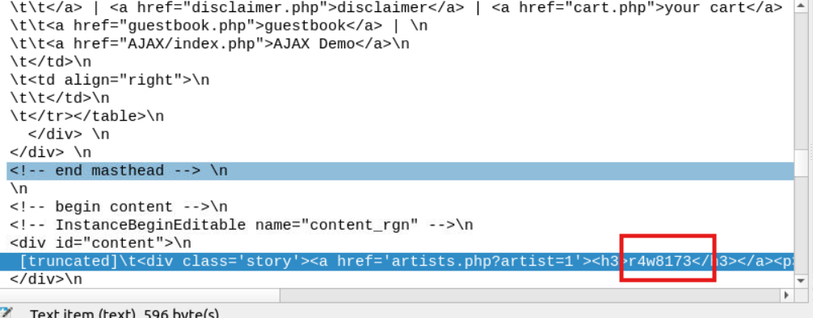
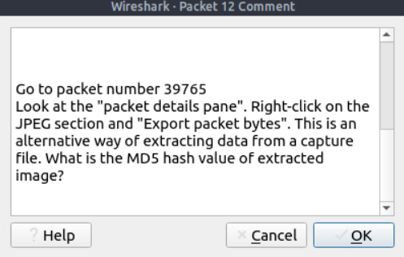
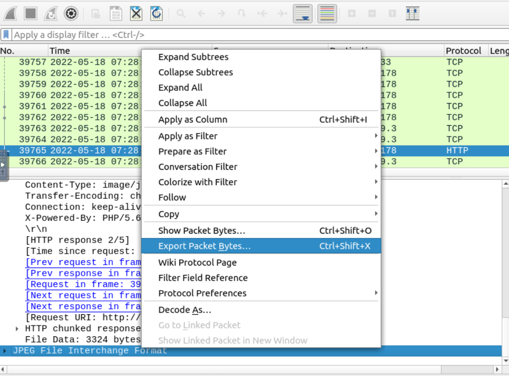
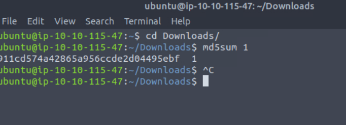

### Answer the questions below
Use the "Exercise.pcapng" file to answer the questions.

**Cau 4.1** Search the "r4w" string in packet details. What is the name of artist 1?

**r4w8173**

**Cau 4.2** Go to packet 12 and read the comments. What is the answer?

B1: Mở comments tệp 12 

Đi đến gói số 39765
Xem "bảng chi tiết gói". Nhấp chuột phải vào phần JPEG và "Xuất byte gói". Đây là một cách thay thế để trích xuất dữ liệu từ tệp chụp. Giá trị băm MD5 của hình ảnh được trích xuất là gì?

B2: Xuất file ảnh

B3: băm md5

**Cau 4.3** There is a ".txt" file inside the capture file. Find the file and read it; what is the alien's name?
B1 tìm file `.txt`, thấy fiel `note.txt`

B2: Vào mục file và tải file đó về

**Cau 4.** Look at the expert info section. What is the number of warnings?
