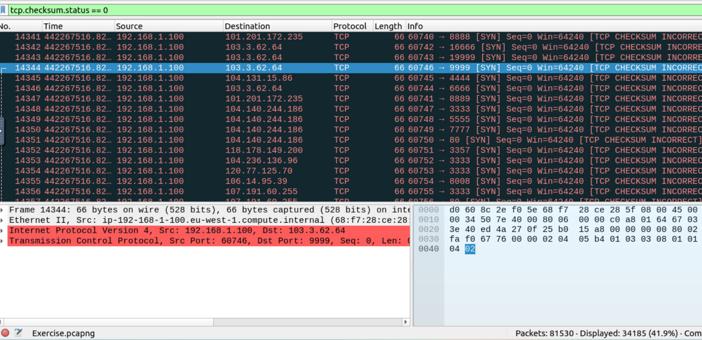

# Wireshark - Summary of Filters and Functions

## Filter: `contains`
- **Type**: Comparison Operator  
- **Description**: Search a value inside packets (case-sensitive).  
- **Usage**: `http.server contains "Apache"`

## Filter: `matches`
- **Type**: Comparison Operator  
- **Description**: Regular expression matching (case-insensitive).  
- **Usage**: `http.host matches "\.(php|html)"`

## Filter: `in`
- **Type**: Set Membership  
- **Description**: Checks if value is in a list.  
- **Usage**: `tcp.port in {80 443 8080}`

## Function: `upper`
- **Type**: String Function  
- **Description**: Convert value to uppercase.  
- **Usage**: `upper(http.server) contains "APACHE"`

## Function: `lower`
- **Type**: String Function  
- **Description**: Convert value to lowercase.  
- **Usage**: `lower(http.server) contains "apache"`

## Function: `string`
- **Type**: Type Conversion

#### Answer the questions below
**Câu 1** Find all Microsoft IIS servers. What is the number of packets that did not originate from "port 80"?

dùng and, not 
> 21

**Câu 2** Find all Microsoft IIS servers. What is the number of packets that have "version 7.5"?

Giống như trong câu hỏi trước, để tìm các máy chủ Microsoft IIS, chúng ta sử dụng “http.server contains “IIS””. Số phiên bản của máy chủ cũng được tìm thấy trong http.server, vì vậy chúng ta có thể sử dụng toán tử matches để tìm tất cả những máy chủ có 7.5. . Bộ lọc đầy đủ  “http.server contains “IIS” && http.server matches “7.5””.

**Câu 3** What is the total number of packets that use ports 3333, 4444 or 9999?
tcp.port in {3333 4444 9999}

**Câu 4** What is the number of packets with "even TTL numbers"?

**Câu 5** Change the profile to "Checksum Control". What is the number of "Bad TCP Checksum" packets?

Để thay đổi cấu hình của chúng ta thành kiểm soát tổng kiểm tra, chúng ta cần điều hướng đến Edit>Configuration Profiles…>Checksum Control>OK. Cấu hình này làm nổi bật các gói tin có tổng kiểm tra không thành công. Để lọc các tổng kiểm tra xấu này, chúng ta có thể sử dụng Analyze>Display Filter Expression… để tạo bộ lọc. Trong menu này, chúng ta có thể cuộn đến tcp.checksum.status hoặc tìm kiếm nó để bắt đầu tạo bộ lọc. Chúng ta đang tìm kiếm bất kỳ gói tin nào xấu để chúng ta có thể sử dụng toán tử “==” và giá trị “Bad” (trong trường hợp này được định nghĩa là 0) để có được bộ lọc đầy đủ.

Sau đó, chúng ta có thể nhấp vào “OK” để bộ lọc này tự động điền thông tin vào bộ lọc và nhận được kết quả.

**Câu 6** Use the existing filtering button to filter the traffic. What is the number of displayed packets?

