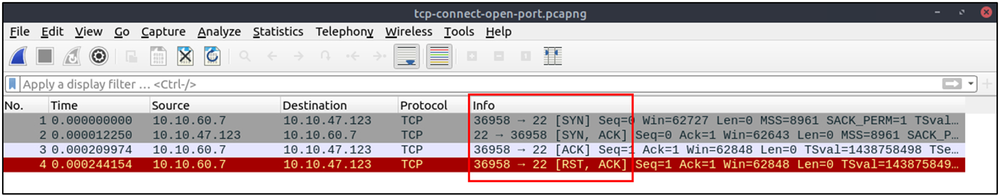
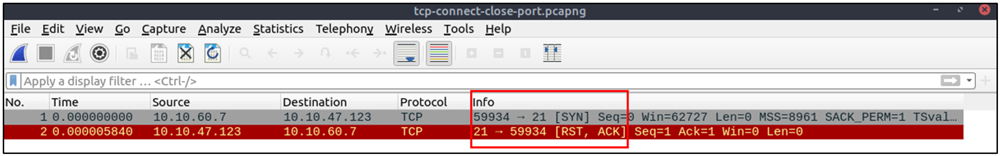

# Phân Tích Các Loại Quét Mạng Bằng Nmap

**Nmap** là một công cụ tiêu chuẩn trong ngành dùng để quét mạng, xác định các host đang hoạt động và phát hiện các dịch vụ. Là một trong những công cụ quét mạng phổ biến nhất, các nhà phân tích an ninh cần hiểu rõ các mẫu lưu lượng mạng được tạo ra bởi Nmap.

## Các Loại Quét Nmap Phổ Biến

- **TCP Connect scan**
- **SYN scan**
- **UDP scan**

Để phát hiện hoạt động quét mạng, cần hiểu cách hoạt động của Nmap. Tuy nhiên, không thể phân tích chi tiết nếu không có bộ lọc phù hợp.

---

## Tổng Quan Cờ TCP và Bộ Lọc Wireshark

| Loại cờ TCP         | Ghi chú                                    | Bộ lọc Wireshark                             |
|----------------------|---------------------------------------------|-----------------------------------------------|
| Tìm kiếm toàn cục     |                                             | `tcp`, `udp`                                  |
| Chỉ cờ SYN            | SYN được bật                                | `tcp.flags == 2`, `tcp.flags.syn == 1`        |
| Chỉ cờ ACK            | ACK được bật                                | `tcp.flags == 16`, `tcp.flags.ack == 1`       |
| SYN + ACK             | Cả SYN và ACK được bật                      | `tcp.flags == 18`, `(tcp.flags.syn == 1) and (tcp.flags.ack == 1)` |
| Chỉ cờ RST            | RST được bật                                | `tcp.flags == 4`, `tcp.flags.reset == 1`      |
| RST + ACK             | Cả RST và ACK được bật                      | `tcp.flags == 20`, `(tcp.flags.reset == 1) and (tcp.flags.ack == 1)` |
| Chỉ cờ FIN            | FIN được bật                                | `tcp.flags == 1`, `tcp.flags.fin == 1`        |

---

## 1. Quét TCP Connect

### Tổng quan:
- Dựa vào bắt tay ba bước (three-way handshake).
- Thường dùng lệnh: `nmap -sT`
- Người dùng không có quyền root có thể sử dụng.
- Cửa sổ TCP (window size) thường > 1024 bytes.

### Mẫu gói tin:

#### Cổng mở:
```
SYN -->
<-- SYN, ACK
ACK -->
```


#### Cổng đóng:
```
SYN -->
<-- RST, ACK
```


### Bộ lọc Wireshark:
```wireshark
tcp.flags.syn==1 and tcp.flags.ack==0 and tcp.window_size > 1024
```

---

## 2. Quét TCP SYN

### Tổng quan:
- Không cần hoàn tất quá trình bắt tay.
- Thường dùng lệnh: `nmap -sS`
- Cần quyền root.
- Kích thước gói tin thường <= 1024 bytes.

### Mẫu gói tin:

#### Cổng mở:
```
SYN -->
<-- SYN, ACK
RST -->
```

#### Cổng đóng:
```
SYN -->
<-- RST, ACK
```

### Bộ lọc Wireshark:
```wireshark
tcp.flags.syn==1 and tcp.flags.ack==0 and tcp.window_size <= 1024
```

---

## 3. Quét UDP

### Tổng quan:
- Không có quá trình bắt tay.
- Không có phản hồi nếu cổng mở.
- Trả về thông báo lỗi ICMP nếu cổng đóng.
- Thường dùng lệnh: `nmap -sU`

### Mẫu gói tin:

#### Cổng mở:
```
UDP -->
(no response)
```

#### Cổng đóng:
```
UDP -->
<-- ICMP Type 3, Code 3 (Port unreachable)
```

### Phân tích lỗi ICMP:
- Gói ICMP chứa dữ liệu gốc từ gói UDP gây lỗi.
- Mở rộng trường ICMP trong Wireshark để xem thông tin gói gốc.

### Bộ lọc Wireshark:
```wireshark
icmp.type==3 and icmp.code==3
```

---

## Lời khuyên khi phân tích:

- Tập trung vào các mẫu bất thường ban đầu với bộ lọc tổng quát.
- Sau đó thu hẹp phạm vi để phân tích lưu lượng cụ thể.

> Bây giờ, hãy sử dụng các tập tin thực hành `.pcap` để luyện tập phân tích và trả lời các câu hỏi liên quan đến các hoạt động quét mạng!
