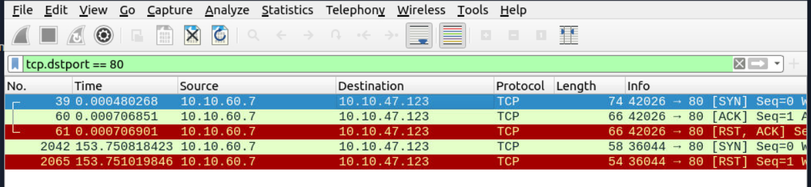
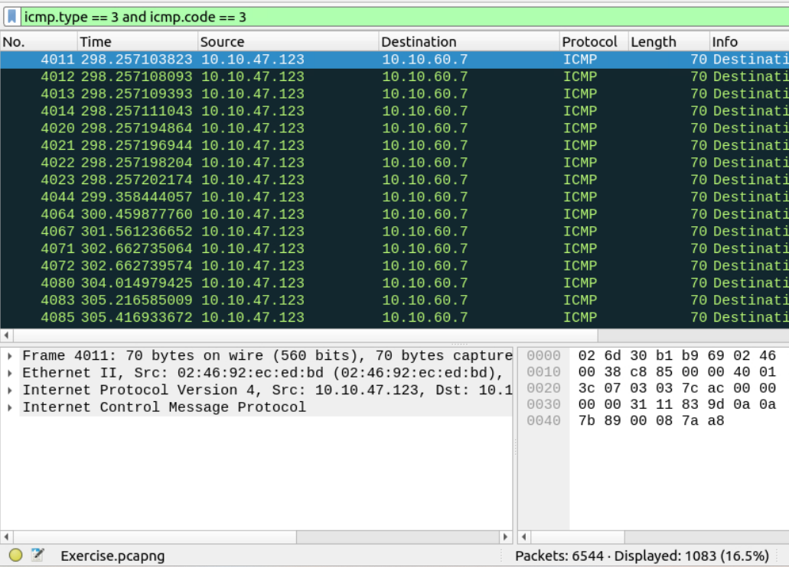
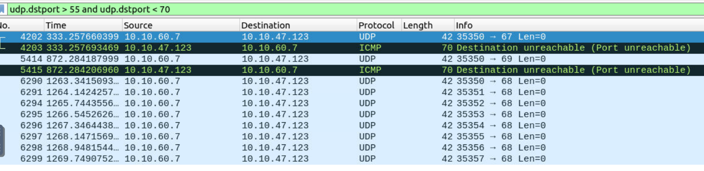

#### Use the "Desktop/exercise-pcaps/nmap/Exercise.pcapng" file.
**Câu 1:** What is the total number of the "TCP Connect" scans?

Mục tiêu: Xác định có bao nhiêu lần TCP Connect scan đã xảy ra trong file .pcap 

`tcp.flags.syn == 1 and tcp.flags.ack == 0 and tcp.window_size > 1024`
Đếm số gói cờ syn trong quá trình bắt tay 3b

**Câu 2:** Loại quét nào được sử dụng để quét cổng TCP 80?

B1: Sử dụng bộ lọc để tìm tất cả gói TCP có đích là cổng 80:
`tcp.dstport == 80`

B2: Đọc các gói tin
| Kiểu quét            | Dấu hiệu chính                  | Cờ TCP                     | Kết nối                   | Đặc điểm                         |
|----------------------|----------------------------------|-----------------------------|---------------------------|----------------------------------|
| TCP Connect Scan (-sT) | Có SYN → SYN-ACK → ACK          | SYN, rồi SYN-ACK, rồi ACK  | Hoàn tất 3 bước bắt tay TCP | Window size thường > 1024       |
| TCP SYN Scan (-sS)     | Có SYN → SYN-ACK → RST          | SYN, rồi SYN-ACK, rồi RST  | Không hoàn tất bắt tay     | Window size thường ≤ 1024       |

Phân tích chi tiết từ ảnh:
🧾 Gói số 39:
42026 → 80 [SYN]
Gói SYN từ client → server (bắt đầu bắt tay TCP)

🧾 Gói số 60:
42026 → 80 [ACK]

Đây chính là ACK từ phía client, gợi ý rằng đã nhận được SYN-ACK từ server
(gói SYN-ACK có thể bị lọc hoặc không được capture, nhưng hành vi client gửi ACK là bằng chứng rõ ràng cho thấy nó đã nhận được SYN-ACK).

🧾 Gói số 61:
42026 → 80 [RST, ACK]

**Kết luận** : Hoàn tất quá trình bắt tay 3buoc
**→** TCP Connect

**Câu 3:** How many "UDP close port" messages are there?

**Câu 4:** Which UDP port in the 55-70 port range is open?
