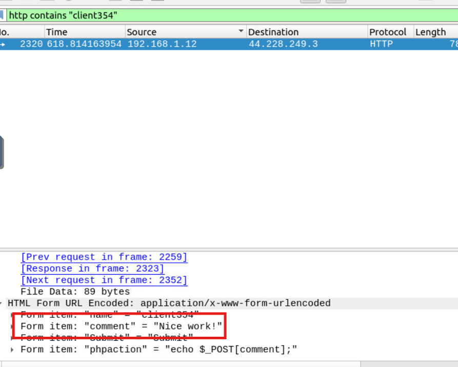

#### Answer the questions below
Use the "Desktop/exercise-pcaps/arp/Exercise.pcapng" file.

**Cau 1** What is the number of ARP requests crafted by the attacker?

B1: Xác định kẻ tấn công
`arp.duplicate-address-detected or arp.duplicate-address-frame`

Địa chỉ MAC của kẻ tấn công
B2:
`arp and arp.opcode == 1 and arb.src.hw_mac = 00:0c:29:e2:18:b4`

**Câu 2:** What is the number of HTTP packets received by the attacker?
`http and eth.addr==  ` các gói tin http có địa chỉ mac là ...

**Câu 3:** What is the number of sniffed username&password entries?

Dùng `http contains "uname"` nhận được 7 gói tin, xem thì có 1 tài khoản lặp lại nên đáp án là 6

**Câu 4:** What is the password of the "Client986"?

**Câu 5:** What is the comment provided by the "Client354"?
