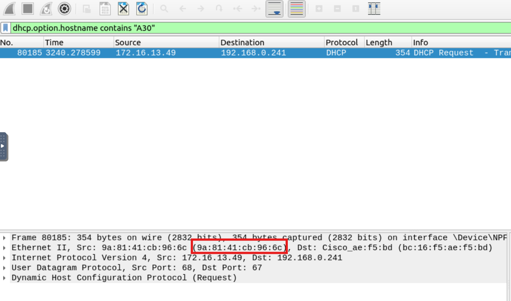
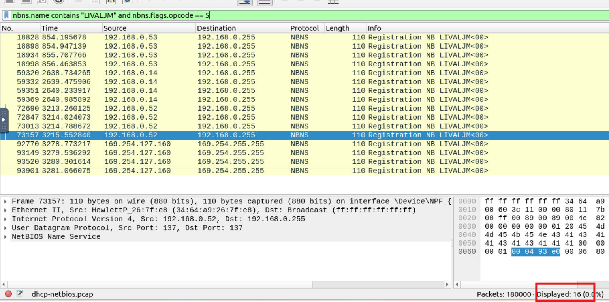
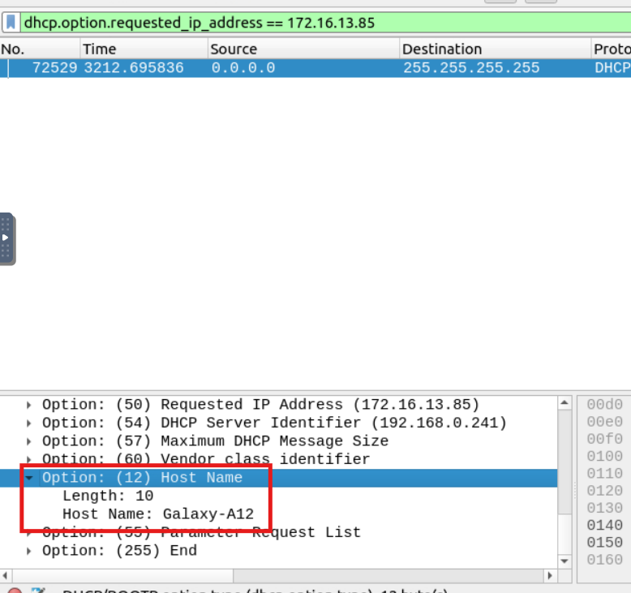
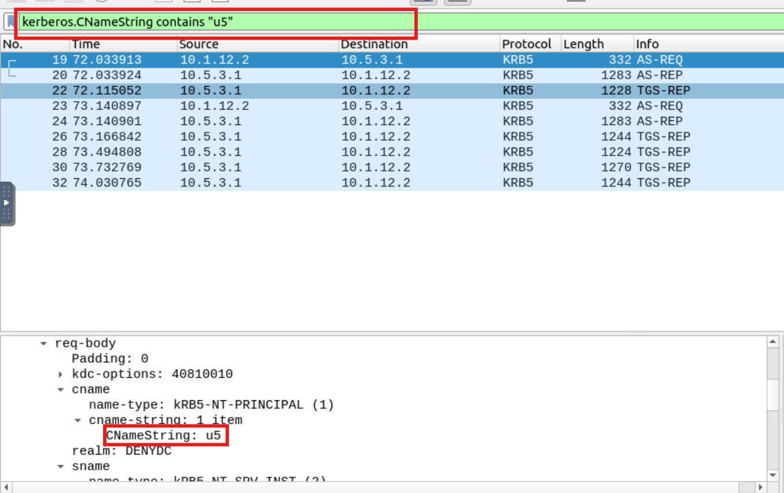
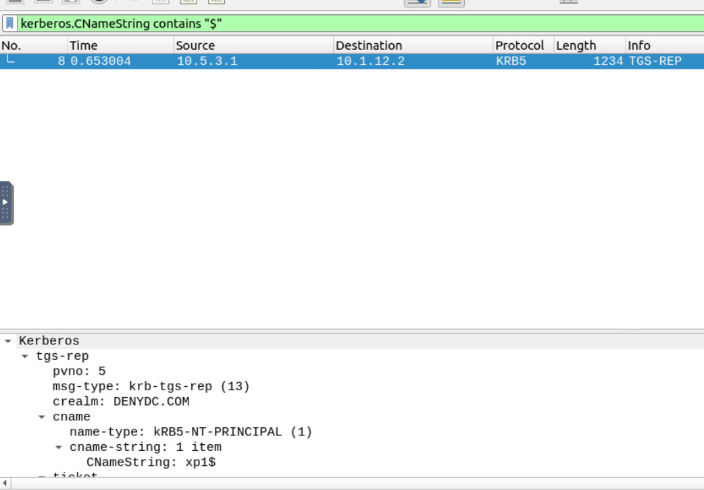

Use the "Desktop/exercise-pcaps/dhcp-netbios-kerberos/dhcp-netbios.pcap" file.

**Câu 1:** What is the MAC address of the host "Galaxy A30"?

**Câu 2:** How many NetBIOS registration requests does the "LIVALJM" workstation have?

**Câu 3** Which host requested the IP address "172.16.13.85"?

**Câu 4:** What is the IP address of the user "u5"? (Enter the address in defanged format.)

**câu 5** What is the hostname of the available host in the Kerberos packets?
Các giá trị kết thúc bằng `$` là tên máy chủ và các giá trị không có “$” là tên người dùng.

$haha$