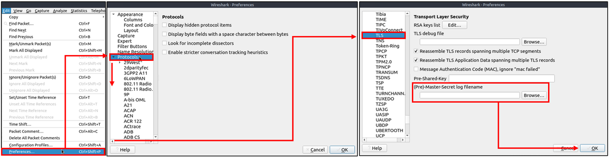
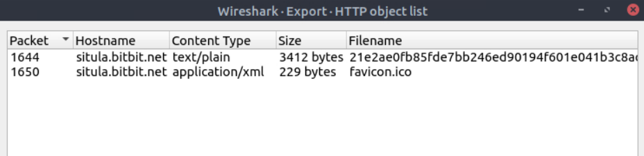

### Answer the questions below
Use the "Desktop/exercise-pcaps/https/Exercise.pcap" file.
**Câu 1:** What is the frame number of the "Client Hello" message sent to "accounts.google.com"?

gói 16

**Câu 2:** Decrypt the traffic with the "KeysLogFile.txt" file. What is the number of HTTP2 packets?
Adding key log files with the "right-click" menu:

Adding key log files with the "Edit --> Preferences --> Protocols --> TLS" menu:

LỌc http2 > Đáp án

**Câu 3:** Go to Frame 322. What is the authority header of the HTTP2 packet? (Enter the address in defanged format.)

**Câu 4:** Investigate the decrypted packets and find the flag! What is the flag?

Vào phần file -> Export Objects -> HTTP

