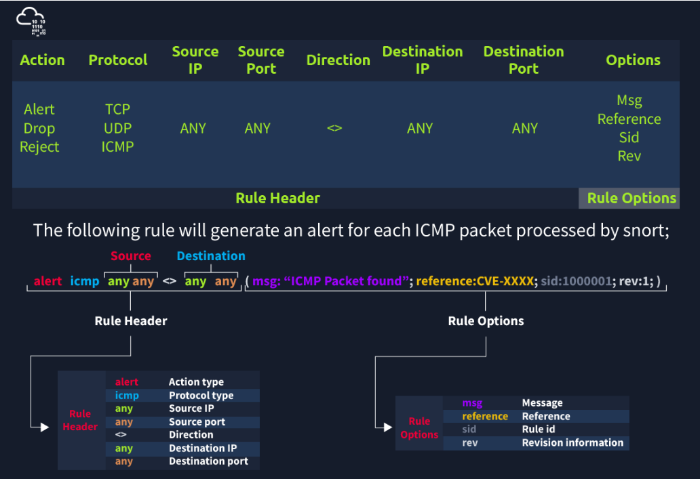

# Let's Learn Snort Rules!



Rule Header là bắt buộc
### 📌 Hành động (Action)

| **Hành động** | **Mô tả** |
|---------------|-----------|
| `alert`       | Tạo cảnh báo và ghi log gói tin. |
| `log`         | Ghi log gói tin. |
| `drop`        | Chặn và ghi log gói tin. |
| `reject`      | Chặn, ghi log và kết thúc phiên giao tiếp của gói tin. |

### 📌 Giao thức (Protocol)

| **Giao thức hỗ trợ** | **Ghi chú** |
|----------------------|-------------|
| IP, TCP, UDP, ICMP   | Snort 2 chỉ hỗ trợ 4 giao thức này trong phần định nghĩa quy tắc. |
| Ứng dụng (Application) | Không thể dùng tên giao thức ứng dụng (như FTP) trực tiếp. Để phát hiện, phải lọc theo cổng (ví dụ: TCP port 21 cho FTP). |

## 🌐 IP và Port Numbers trong Snort

Các tham số này xác định địa chỉ IP nguồn, đích và số hiệu cổng được lọc theo quy tắc.

### 📌 Lọc IP (IP Filtering)

| **Mô tả** | **Cú pháp Snort** | **Ghi chú** |
|----------|--------------------|-------------|
| Lọc IP đơn | `alert icmp 192.168.1.56 any <> any any (msg: "ICMP Packet From"; sid: 100001; rev:1;)` | Tạo cảnh báo với mỗi gói ICMP từ IP 192.168.1.56 |
| Lọc subnet | `alert icmp 192.168.1.0/24 any <> any any (msg: "ICMP Packet Found"; sid: 100001; rev:1;)` | Tạo cảnh báo với mỗi gói ICMP từ subnet 192.168.1.0/24 |
| Lọc nhiều subnet | `alert icmp [192.168.1.0/24, 10.1.1.0/24] any <> any any (msg: "ICMP Packet Found"; sid: 100001; rev:1;)` | Tạo cảnh báo với mỗi gói ICMP từ hai subnet trên |
| Loại trừ IP/subnet | `alert icmp !192.168.1.0/24 any <> any any (msg: "ICMP Packet Found"; sid: 100001; rev:1;)` | Tạo cảnh báo với ICMP không đến từ subnet 192.168.1.0/24 |

### 📌 Lọc cổng (Port Filtering)

| **Mô tả** | **Cú pháp Snort** | **Ghi chú** |
|----------|--------------------|-------------|
| Lọc cổng FTP | `alert tcp any any <> any 21 (msg: "FTP Port 21 Command Activity Detected"; sid: 100001; rev:1;)` | Cảnh báo gói TCP gửi đến cổng 21 |
| Loại trừ cổng 21 | `alert tcp any any <> any !21 (msg: "Traffic Activity Without FTP Port 21 Command Channel"; sid: 100001; rev:1;)` | Cảnh báo gói TCP không gửi đến cổng 21 |
| Lọc khoảng cổng 1–1024 | `alert tcp any any <> any 1:1024 (msg: "TCP 1-1024 System Port Activity"; sid: 100001; rev:1;)` | Cảnh báo gói TCP đến cổng từ 1 đến 1024 |
| Lọc cổng ≤ 1024 | `alert tcp any any <> any :1024 (msg: "TCP 0-1024 System Port Activity"; sid: 100001; rev:1;)` | Cảnh báo gói TCP đến cổng nhỏ hơn hoặc bằng 1024 |
| Lọc cổng ≥ 1025 | `alert tcp any any <> any 1025: (msg: "TCP Non-System Port Activity"; sid: 100001; rev:1;)` | Cảnh báo gói TCP đến cổng từ 1025 trở lên |
| Lọc nhiều cổng cụ thể | `alert tcp any any <> any [21,23] (msg: "FTP and Telnet Port 21-23 Activity Detected"; sid: 100001; rev:1;)` | Cảnh báo gói TCP đến cổng 21 và 23 |

### 📌Direction

Toán tử hướng chỉ ra luồng lưu lượng sẽ được Snort lọc. Phía bên trái của quy tắc hiển thị nguồn và phía bên phải hiển thị đích.

>-> Luồng từ nguồn đến đích.
<> Dòng chảy hai chiều
Lưu ý rằng  không có toán tử "<-" trong Snort.

### ⚙️ Snort Rule Options

### 📌 General Rule Options

| **Tùy chọn** | **Mô tả** |
|--------------|-----------|
| `msg`        | Thông điệp hiển thị khi quy tắc được kích hoạt; hiển thị trên console hoặc log. |
| `sid`        | Snort Rule ID: < 100 là dành riêng, 100–999,999 là mặc định theo bộ cài, ≥ 1.000.000 là do người dùng tạo. Mỗi SID phải là duy nhất. |
| `reference`  | Tham chiếu đến nguồn thông tin bên ngoài (như CVE), giúp phân tích cảnh báo hiệu quả hơn. |
| `rev`        | Số lần sửa đổi quy tắc. Không có tự động lưu lịch sử, người dùng cần quản lý. |

🔹 **Ví dụ:**
```snort
alert icmp any any <> any any (msg: "ICMP Packet Found"; sid: 100001; reference:cve,CVE-XXXX; rev:1;)
```

### 📦 Payload Detection Rule Options

| **Tùy chọn**    | **Mô tả** |
|------------------|-----------|
| `content`        | Tìm kiếm chuỗi trong payload theo dạng ASCII hoặc HEX. Có thể dùng nhiều lần trong một rule. Phân biệt hoa/thường. |
| `nocase`         | Bỏ phân biệt chữ hoa/chữ thường trong tìm kiếm `content`. |
| `fast_pattern`   | Tăng tốc độ quét payload bằng cách chỉ định chuỗi được ưu tiên kiểm tra đầu tiên. Dùng một lần trong mỗi rule. |

### 🔹 Ví dụ:

```snort
alert tcp any any <> any 80 (msg: "GET Request Found"; content:"GET"; sid:100001; rev:1;)
alert tcp any any <> any 80 (msg: "GET Request Found"; content:"|47 45 54|"; sid:100001; rev:1;)
alert tcp any any <> any 80 (msg: "GET Request Found"; content:"GET"; nocase; sid:100001; rev:1;)
alert tcp any any <> any 80 (msg: "GET Request Found"; content:"GET"; fast_pattern; content:"www"; sid:100001; rev:1;)
```

| **Tùy chọn Rule**  | **Mô tả**                                                                                                                                                              | **Ví dụ**                                                                                                                                               |
|---------------------|------------------------------------------------------------------------------------------------------------------------------------------------------------------------|---------------------------------------------------------------------------------------------------------------------------------------------------------|
| **ID**              | Lọc theo trường ID trong header IP, được sử dụng để theo dõi phân mảnh.                                                                                              | `alert tcp any any <> any any (msg: "ID TEST"; id:123456; sid: 100001; rev:1;)`                                                                       |
| **Flags**           | Lọc theo các cờ TCP (FIN, SYN, RST, PSH, ACK, URG) để phát hiện các kết nối hoặc trạng thái cụ thể.                                                                  | `alert tcp any any <> any any (msg: "FLAG TEST"; flags:S; sid: 100001; rev:1;)`                                                                       |
| **Dsize**           | Lọc theo kích thước payload của gói tin. Bạn có thể đặt kích thước tối thiểu hoặc tối đa cho payload.                                                                  | `alert ip any any <> any any (msg: "SEQ TEST"; dsize:100<>300; sid: 100001; rev:1;)`                                                                   |
| **Sameip**          | Lọc để phát hiện các địa chỉ IP nguồn và đích bị trùng lặp trong cùng một gói tin.                                                                                   | `alert ip any any <> any any (msg: "SAME-IP TEST"; sameip; sid: 100001; rev:1;)`                                                                      |

**Hãy nhớ rằng, sau khi bạn tạo một quy tắc, đó là quy tắc cục bộ và phải nằm trong tệp "local.rules" của bạn. Tệp này nằm trong "/etc/snort/rules/local.rules".**
**Dùng nano hoặc  `sudo gedit /etc/snort/rules/local.rules` để thêm rule**

#### Trả lời câu hỏi: 

> **Câu 1:** Use "task9.pcap". Write a rule to filter IP ID "35369" and run it against the given pcap file. What is the request name of the detected packet? You may use this command: "snort -c local.rules -A full -l . -r task9.pcap"

B1: Thêm ruler vào local.rules
.png>)

B2: Chạy lệnh `snort -c local.rules -A full -l . -r task9.pcap`  để phân tích lại file "task9.pcap", áp dụng các rule định nghĩa trong local.rules, ghi log cảnh báo ra thư mục hiện tại với định dạng đầy đủ.
.png>)

B3: đọc file log `sudo snort -r snort.log.1747068618`
.png)

> **Câu 2:** Clear the previous alert file and comment out the old rules. Create a rule to filter packets with Syn flag and run it against the given pcap file. What is the number of detected packets?

B1: Thêm ruler vào local.rules
.png>)
B2 : Chạy lệnh `snort -c local.rules -A full -l . -r task9.pcap` 

B3: B3: đọc file log 
.png)

> **Câu 3:** Clear the previous alert file and comment out the old rules. Write a rule to filter packets with Push-Ack flags and run it against the given pcap file. What is the number of detected packets?

Tương tự 
.png>)

> **Câu 4:** Clear the previous alert file and comment out the old rules. Create a rule to filter UDP packets with the same source and destination IP and run it against the given pcap file. What is the number of packets that show the same source and destination address?

.png>)
.png>)

> **Câu 5:**Case Example - An analyst modified an existing rule successfully. Which rule option must the analyst change after the implementation?

> **Trả lời** rev
