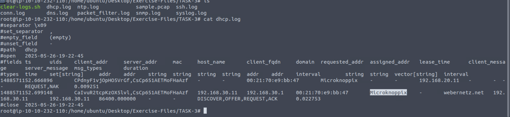

# Nhật Ký Zeek (Zeek Logs)

Zeek tạo ra các tệp log dựa trên dữ liệu lưu lượng mạng. Bạn sẽ có log cho mọi kết nối trên đường truyền, bao gồm cả giao thức ở tầng ứng dụng và các trường thông tin liên quan. Zeek có khả năng nhận diện hơn 50 loại log và phân loại chúng thành 7 nhóm. Các log của Zeek có cấu trúc rõ ràng dưới dạng file ASCII được phân cách bằng tab, do đó dễ đọc và xử lý, tuy nhiên yêu cầu kiến thức chuyên sâu. Bạn cần nắm vững kiến thức về mạng và giao thức để phân tích, xác định điểm cần chú ý và tìm ra bằng chứng cụ...

Mỗi dòng log bao gồm nhiều trường, mỗi trường thể hiện một phần thông tin về lưu lượng. Việc tương quan được thực hiện thông qua giá trị duy nhất gọi là “UID” — đại diện cho một phiên kết nối cụ thể.

## Tóm tắt các log trong Zeek:

| Nhóm | Mô tả | Tệp log |
|------|------|----------|
| **Mạng** | Ghi lại thông tin giao thức mạng | `conn.log`, `dns.log`, `http.log`, `ftp.log`, `ssh.log`, `ssl.log`,... |
| **Tập tin** | Kết quả phân tích file | `files.log`, `pe.log`, `x509.log`,... |
| **Kiểm soát mạng** | Nhật ký điều khiển mạng | `netcontrol.log`, `openflow.log`,... |
| **Phát hiện** | Nhật ký phát hiện mối đe dọa | `intel.log`, `notice.log`, `signatures.log`,... |
| **Quan sát mạng** | Quan sát tổng thể lưu lượng | `known_hosts.log`, `software.log`, `known_services.log`,... |
| **Khác** | Các nhật ký phụ hoặc lỗi | `weird.log`, `unknown_protocols.log`,... |
| **Chẩn đoán Zeek** | Các thông báo hệ thống & thống kê | `broker.log`, `stats.log`, `stderr.log`,... |

Một số tệp log phổ biến và tần suất cập nhật:

| Tần suất | Tên log | Mô tả |
|----------|---------|-------|
| Hàng ngày | `known_hosts.log` | Danh sách host đã bắt tay TCP thành công |
| Hàng ngày | `software.log` | Danh sách phần mềm sử dụng trong mạng |
| Mỗi phiên | `notice.log` | Các bất thường được Zeek phát hiện |
| Mỗi phiên | `intel.log` | Ghi nhận khi có chỉ số tấn công (IoC) |
| Mỗi phiên | `signatures.log` | Danh sách chữ ký được kích hoạt |

## Hướng dẫn sử dụng log (tóm tắt):

| Tổng quan | Theo giao thức | Phát hiện | Quan sát |
|-----------|----------------|-----------|----------|
| `conn.log`, `files.log`, `intel.log`, `loaded_scripts.log` | `http.log`, `dns.log`, `ftp.log`, `ssh.log` | `notice.log`, `signatures.log`, `traceroute.log` | `known_hosts.log`, `known_services.log`, `software.log`, `weird.log` |

**Ghi nhớ**:
- Zeek logs là file ASCII có cấu trúc rõ ràng → dễ xử lý nhưng cần kiến thức.
- Cần dùng các công cụ dòng lệnh như `cat`, `cut`, `grep`, `sort`, `uniq` và chương trình hỗ trợ `zeek-cut`.

## Công cụ hỗ trợ

| Tên | Mục đích |
|-----|----------|
| `zeek-cut` | Trích xuất cột cụ thể từ log Zeek |

### Ví dụ sử dụng `zeek-cut`:

```bash
cat conn.log | zeek-cut uid proto id.orig_h id.orig_p id.resp_h id.resp_p
```

**Kết quả:**

```bash
CTMFXm1AcIsSnq2Ric  udp  192.168.121.2   51153   192.168.120.22  53
CLsSsA3HLB2N6uJwW   udp  192.168.121.10  50080   192.168.120.10  514
```

Kết luận: `zeek-cut` là công cụ rất mạnh để lọc nhanh dữ liệu từ log. Việc đọc và phân tích log cần được luyện tập thường xuyên để hiểu định dạng và mục đích từng log nhằm phục vụ điều tra.

Bạn có thể tùy biến mô hình phân tích theo yêu cầu cụ thể. Đừng chỉ dựa vào ví dụ – mỗi cuộc điều tra đòi hỏi sự hiểu biết riêng về dữ liệu cần tìm.


### Answer the questions below

**Câu 1** Investigate the sample.pcap file. Investigate the dhcp.log file. What is the available hostname?



**Câu 2** Investigate the dns.log file. What is the number of unique DNS queries?


