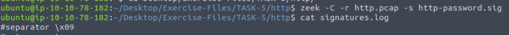
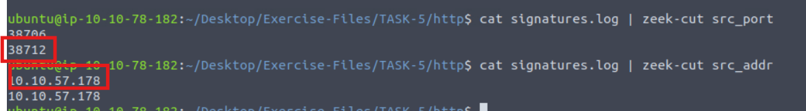
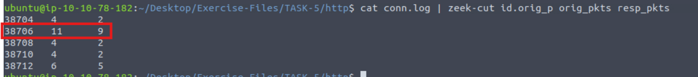
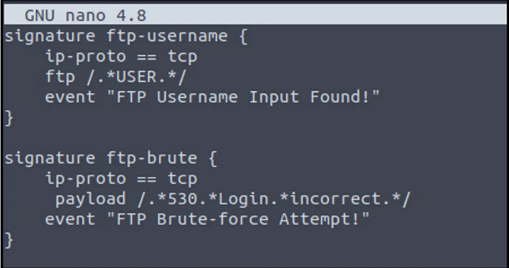
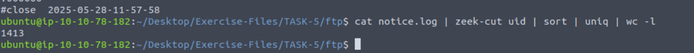
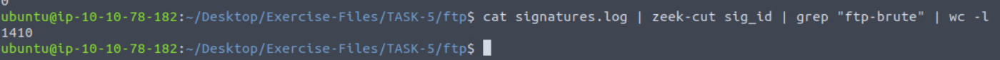

# Chữ Ký (Signatures) trong Zeek

Zeek sử dụng các chữ ký để phát hiện và liên kết các hoạt động đáng chú ý trên mạng. Khác với Snort, chữ ký trong Zeek không phải là cơ chế phát hiện chính, mà đóng vai trò hỗ trợ trong việc liên kết các sự kiện. Dưới đây là tổng quan về chữ ký trong Zeek:

## Thành Phần Của Chữ Ký

Chữ ký trong Zeek gồm ba phần chính:

- **ID Chữ Ký**: Tên định danh duy nhất cho chữ ký.
- **Điều Kiện**: Tiêu chí để lọc lưu lượng mạng.
  - **Header**: Lọc theo IP nguồn/đích, cổng và giao thức.
  - **Content**: Lọc theo payload gói tin, HTTP request, lệnh FTP, v.v.
- **Hành Động**: Phản hồi khi khớp chữ ký.
  - **Hành Động Mặc Định**: Ghi log vào `signatures.log`.
  - **Hành Động Bổ Sung**: Kích hoạt một script Zeek.

## Các Điều Kiện Và Bộ Lọc Phổ Biến

Zeek hỗ trợ nhiều điều kiện và bộ lọc khác nhau:

| Trường Điều Kiện      | Bộ Lọc Hỗ Trợ                                |
|------------------------|----------------------------------------------|
| Header                 | src-ip, dst-ip, src-port, dst-port, ip-proto |
| Content                | payload, http-request, lệnh ftp              |
| Context                | same-ip                                      |

Các toán tử như `==`, `!=`, `<`, `<=`, `>`, `>=` được hỗ trợ để so sánh. Bộ lọc có thể sử dụng chuỗi, số hoặc biểu thức chính quy (regex).

## Ví Dụ: Gửi Mật Khẩu Dạng Văn Bản Rõ (Cleartext Password)

Tạo chữ ký Zeek để phát hiện mật khẩu trong HTTP ở dạng văn bản rõ sử dụng regex. Khi phát hiện, Zeek sẽ ghi log và cảnh báo:

```bash
zeek -C -r http.pcap -s http-password.sig
```

Log tạo ra:
- `signatures.log`
- `notice.log`

## Ví Dụ: Tấn Công Brute-force FTP

Tạo chữ ký Zeek để phát hiện brute-force FTP bằng cách giám sát lệnh FTP:

```bash
zeek -C -r ftp.pcap -s ftp-admin.sig
```

Log kết quả:
- `signatures.log`

## Ghi Chú Về Việc Sử Dụng Luật Snort Trong Zeek

Trước đây, Zeek (khi còn gọi là Bro) hỗ trợ luật Snort qua script `snort2bro`, chuyển đổi luật Snort sang chữ ký Zeek. Tuy nhiên, script này không còn được hỗ trợ sau khi Zeek đổi tên.

---

## Trả Lời Câu Hỏi

### 1. Điều tra file http.pcap. Tạo chữ ký HTTP như hướng dẫn và kiểm tra pcap.
- **Địa chỉ IP nguồn của sự kiện đầu tiên:**  



---

### 2. Cổng nguồn của sự kiện thứ hai là gì?


---

### 3. Kiểm tra file conn.log. Tổng số gói tin gửi và nhận từ source port 38706 là bao nhiêu?


---

### 5.Tạo global rule như hướng dẫn và kiểm tra file ftp.pcap.
 Kiểm tra file notice.log. Có bao nhiêu sự kiện duy nhất?

Trước tiên, hãy tạo quy tắc toàn cục.  
  
Bây giờ chúng ta hãy đọc tệp pcap có chữ ký đã được áp dụng.  
`zeek -C -r ftp.pcap -s ftp-brutegorce.sig`

Kiểm tra notice.log  
`cat notice.log |zeek-cut uid | sort | uniq | wc -l`  
sort: Sắp xếp các dòng uid.  
uniq: Loại bỏ các uid trùng lặp.  
wc -l: Đếm số dòng còn lại ⇒ tức là đếm số uid duy nhất.  


---
---

### 6. Có bao nhiêu lần khớp chữ ký ftp-brute?

