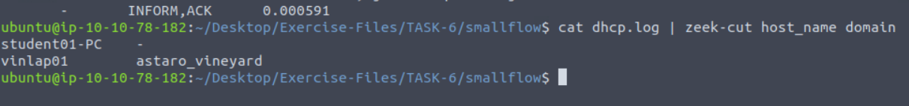
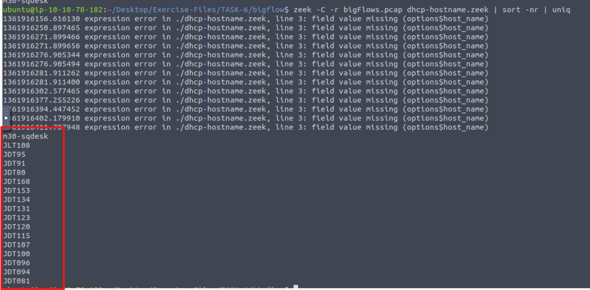
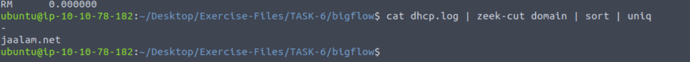

### Question 1:
What is the domain value of the "vinlap01" host in the `smallFlows.pcap` file and `dhcp.log` file?

**Answer:** astaro_vineyard

---

### Question 2:
How many unique hostnames are identified in the `bigFlows.pcap` file and `dhcp.log` file?

**Answer:** 17

---

### Question 3:
What is the identified domain value in the `dhcp.log` file?

**Answer:** jaalam.net