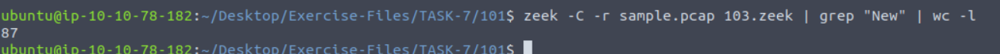
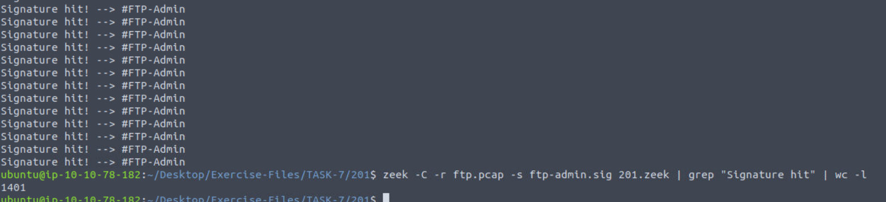
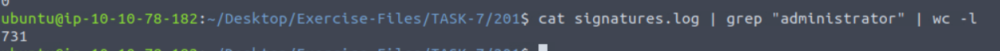
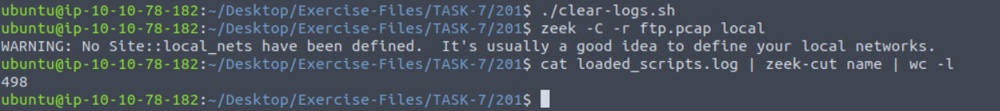
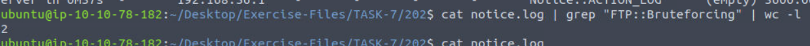

### Answer the questions below

---

**Cau 2.** Go to folder TASK-7/101.  
Investigate the `sample.pcap` file with `103.zeek` script. Investigate the terminal output.  
What is the number of the detected new connections?

**Answer:** 87

---

**Cau 3.** Go to folder TASK-7/201.  
Investigate the `ftp.pcap` file with `ftp-admin.sig` signature and `201.zeek` script. Investigate the `signatures.log` file.  
What is the number of signature hits?*
`zeek -C -r ftp.cap -s stp-admin.sig 201.zeek`

**Answer:** ___

---

**Cau 4.** Investigate the `signatures.log` file.  
What is the total number of "administrator" username detections?**

**Answer:** ___

---

**Cau 5.** Investigate the `ftp.pcap` file with all local scripts, and investigate the `loaded_scripts.log` file.  
What is the total number of loaded scripts?*

**Answer:** ___

---

**Cau 6.** Go to folder TASK-7/202.  
Investigate the `ftp-brute.pcap` file with `/opt/zeek/share/zeek/policy/protocols/ftp/detect-bruteforcing.zeek` script. Investigate the `notice.log` file.  
What is the total number of brute-force detections?

**Answer:** ___
