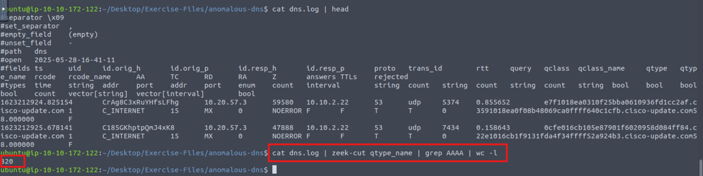

**Cau 1:** Investigate the dns-tunneling.pcap file. Investigate the dns.log file. What is the number of DNS records linked to the IPv6 address?
**Tra loi**
Trong DNS, các truy vấn liên quan đến địa chỉ IPv6 sử dụng:

qtype_name == AAAA → đây là truy vấn để lấy địa chỉ IPv6 của tên miền.
Nen dung `cat dns.log | zeek-cut qtype_name | grep AAAA | wc -l`

**Cau 2:** Investigate the conn.log file. What is the longest connection duration?

`cat conn.log | zeek-cut duration`
**Dap an** 9.420791

